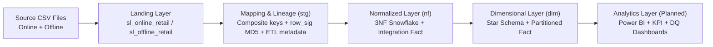
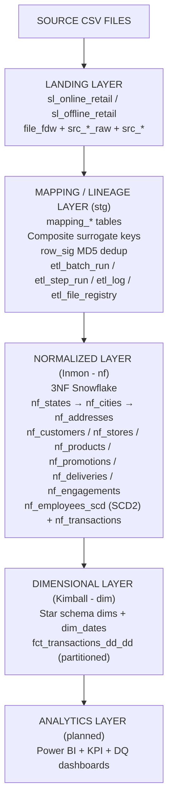
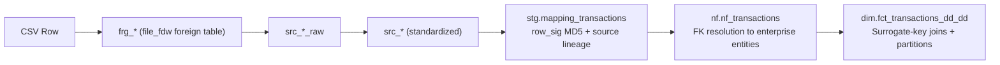
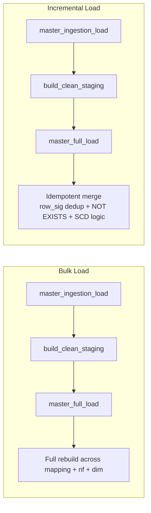
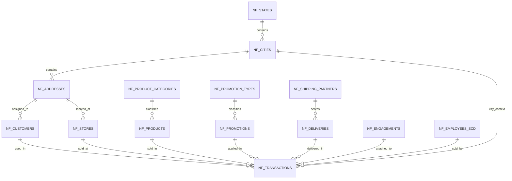
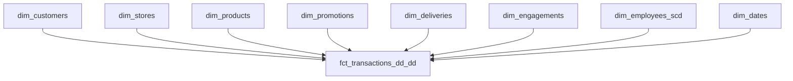
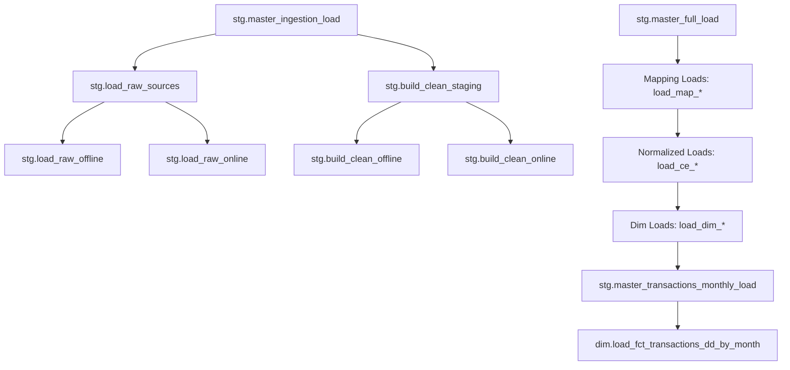
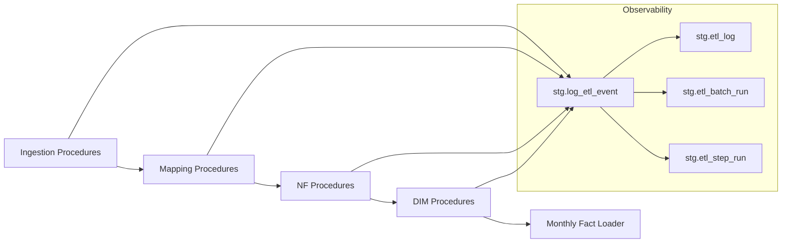
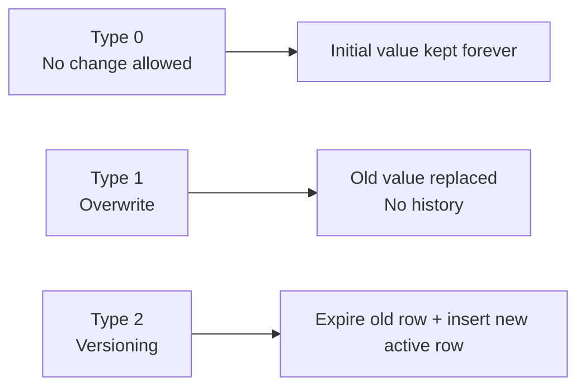
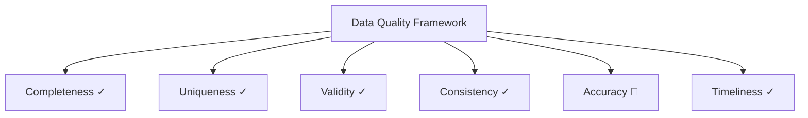

# Retail Data Warehouse Pipeline
### A SQL-Native, End-to-End ELT Data Warehouse — Built on PostgreSQL in Google Colab

> **Status:** Active development · Bulk load complete · Incremental load tested · Data quality layer in progress  
> **Stack:** PostgreSQL 14 · PL/pgSQL · Google Colab · file_fdw · Python (setup only)  
> **Architecture:** Hybrid Inmon-Kimball (Corporate Information Factory model)

---

## Table of Contents

1. [Project Overview](#1-project-overview)
2. [Why This Project Exists](#2-why-this-project-exists)
3. [Key Concepts](#3-key-concepts)
4. [Architecture Overview](#4-architecture-overview)
5. [Data Flow Diagram](#5-data-flow-diagram)
6. [Layer Responsibilities](#6-layer-responsibilities)
7. [Entity-Relationship Diagrams](#7-entity-relationship-diagrams)
8. [Star Schema & Bus Matrix](#8-star-schema--bus-matrix)
9. [Pipeline Orchestration Flow](#9-pipeline-orchestration-flow)
10. [SCD Strategy by Entity](#10-scd-strategy-by-entity)
11. [Data Quality & Governance Framework](#11-data-quality--governance-framework)
12. [Design Decisions](#12-design-decisions)
13. [Project Roadmap](#13-project-roadmap)
14. [How to Run](#14-how-to-run)
15. [Repository Structure](#15-repository-structure)

---

## 1. Project Overview

This project implements a production-grade **ELT (Extract → Load → Transform) data warehouse pipeline** using only PostgreSQL and PL/pgSQL — no third-party orchestration tool, no external transformation engine. All transformation logic lives inside the database engine itself.

The dataset consists of **two synthetic retail CSV files** (500,000 rows each): one representing online retail transactions, one representing offline (in-store) transactions. Both sources are transaction-grained — every row is one sales event.

The pipeline ingests, standardizes, normalizes (Inmon), and then denormalizes (Kimball) this data into a fully operational data warehouse with:

- A **3NF Snowflake Schema** (`nf` schema) serving as the integration layer
- A **Star Schema** (`dim` schema) serving as the analytics/reporting layer
- A complete **orchestration and logging infrastructure** tracking every batch, step, and row count
- A **mapping/lineage layer** (`stg` schema) preserving source keys and composite surrogate derivations
- **SCD Type 0, 1, and 2** strategies applied per entity based on business semantics
- **Range partitioning** on the fact table, **BRIN and B-tree indexes** for query performance



---

## 2. Why This Project Exists

Most data engineering tutorials skip the hard parts: entity resolution, composite key derivation, SCD versioning, referential integrity enforcement, and orchestration metadata. This project was built to answer the question:

**"Can a full enterprise-grade DWH pipeline be designed and executed using only SQL — without dbt, Airflow, or a cloud warehouse?"**

The answer is yes. And building it this way forces a deeper understanding of what tools like dbt, Snowflake, and Airflow are actually abstracting away.

**Infrastructure constraint as a design driver:** Because the development environment is Google Colab (no persistent local PostgreSQL, no DBeaver, no VS Code), the entire pipeline was engineered to run inside a Colab notebook — including a self-contained PostgreSQL 14 cluster installed via `apt-get`, and CSV data loaded using PostgreSQL's native `file_fdw` extension (foreign data wrapper). This made `file_fdw` act as the ingestion interface instead of `\COPY` or external loaders, which is an unusual but fully valid production pattern for file-based ingestion.

---

## 3. Key Concepts

| Term | Definition | Used in This Project |
|---|---|---|
| **ELT** | Extract → Load → Transform. Data lands raw first; all transformation happens inside the target DB engine. | Full pipeline pattern. Raw CSV → PostgreSQL → transformation in PL/pgSQL |
| **ETL** | Extract → Transform → Load. Transformation happens outside the DB before loading. | Not used here — distinguished intentionally |
| **file_fdw** | PostgreSQL foreign data wrapper that maps a CSV file to a virtual table (foreign table) queryable with SQL. | Used to ingest online and offline CSV files as `frg_online_retail` and `frg_offline_retail` |
| **Staging Layer** | A landing zone that holds raw + standardized source data before business logic is applied. | `sl_online_retail` and `sl_offline_retail` schemas |
| **Data Integration** | Combining data from multiple source systems into a unified structure. | UNION ALL of online and offline sources in mapping procedures |
| **Source Key (NK)** | The natural key from the source system (e.g. `customer_id` from the CSV). Also called Natural Key. | Stored as `*_id_nk` in mapping tables |
| **Composite Key** | A surrogate key derived by concatenating multiple attributes where no single reliable NK exists. | `customer_src_id = gender + marital_status + dob + zip + city + state` |
| **Surrogate Key** | A system-generated integer key used as the primary key in normalized and dimensional layers. | All `nf.*` and `dim.*` tables use BIGINT surrogates via sequences |
| **SCD Type 0** | Fixed — once loaded, values never change. | `nf_stores`, `nf_deliveries`, `nf_promotions` |
| **SCD Type 1** | Overwrite — new values replace old values. No history kept. | `nf_customers`, `nf_products` |
| **SCD Type 2** | Versioning — each change creates a new row with `start_dt`, `end_dt`, `is_active`. History is preserved. | `nf_employees_scd`, `dim_employees_scd` |
| **3NF (Snowflake Schema)** | Third Normal Form. Each table stores facts about one entity only; related data is in separate tables joined by FK. | `nf` schema — 13 tables with FK hierarchy |
| **Star Schema** | Denormalized dimensional model. Dimension attributes are flattened into wide tables around a central fact. | `dim` schema — 7 dimensions + 1 partitioned fact table |
| **Inmon CIF** | Corporate Information Factory. Bill Inmon's methodology: build a normalized enterprise DWH first, then derive data marts. | `nf` schema mirrors the CIF integration layer |
| **Hybrid Inmon-Kimball** | Architecture that maintains both a 3NF integration layer (Inmon) and Star Schema data mart (Kimball). | Exact architecture of this project |
| **Data Profiling** | Statistical analysis of source data to understand distribution, nullability, uniqueness, and grain. | Performed post-standardization to validate entity grain |
| **Data Quality (DQ)** | Fitness of data for its intended use, measured across 6 dimensions. | DQ framework defined — test implementation in progress |
| **Data Governance** | Policies, roles, and controls that ensure data is managed responsibly. | GRANT/REVOKE role-based access control defined; audit log table created |
| **MD5 Row Signature** | An MD5 hash of key fields used as a duplicate-detection fingerprint for transaction rows. | `row_sig = MD5(source_system || transaction_id || customer_id || product_id || ...)` |
| **Referential Integrity** | All foreign key references point to a real row — no orphan records. | Default (-1) sentinel rows inserted in all dimension/reference tables before fact load |
| **Range Partitioning** | Splitting a large table by a range of values (e.g. date) so queries only scan relevant partitions. | `fct_transactions_dd_dd` partitioned by `transaction_date` monthly |
| **BRIN Index** | Block Range INdex. Lightweight index for ordered columns in large tables (e.g. dates). | Applied to `transaction_dt` on fact table for time-range query acceleration |
| **Bus Matrix** | A Kimball artifact showing which dimensions participate in which business processes. | See Section 8 |

---

## 4. Architecture Overview

This project follows the **Hybrid Inmon-Kimball** architecture, also known as the **Corporate Information Factory (CIF)** model:

In short, the platform is a **hybrid warehouse architecture** combining normalized integration with dimensional analytics.



**Diagram above is GitHub-native Mermaid and replaces the previous image placeholder.**

---

## 5. Data Flow Diagram



### Ingestion modes

**Bulk load (initial):**  
`stg.master_ingestion_load()` → `stg.load_raw_sources()` → `stg.build_clean_staging()` → `stg.master_full_load()` → all mapping, NF, and DIM layers

**Incremental load:**  
Same master procedure — idempotency is guaranteed by `row_sig` deduplication on mapping_transactions and `NOT EXISTS` guards on all NF and DIM inserts. New rows are appended; existing rows are skipped or updated per SCD type.



---

## 6. Layer Responsibilities

| Layer | Schema | Purpose | Key Tables | Load Strategy |
|---|---|---|---|---|
| **Landing — Online** | `sl_online_retail` | Raw ingest from online CSV | `frg_online_retail` (foreign), `src_online_retail_raw`, `src_online_retail` | Full reload via file_fdw; standardization via CREATE TABLE AS |
| **Landing — Offline** | `sl_offline_retail` | Raw ingest from offline CSV | `frg_offline_retail` (foreign), `src_offline_retail_raw`, `src_offline_retail` | Full reload via file_fdw; standardization via CREATE TABLE AS |
| **Mapping / Orchestration** | `stg` | Entity lineage, key derivation, pipeline control | `mapping_customers`, `mapping_transactions` (+ 6 others), `etl_batch_run`, `etl_log` | Incremental insert with NOT EXISTS; MD5 row_sig for transactions |
| **Normalized (Inmon)** | `nf` | 3NF integration layer, single source of truth | `nf_customers`, `nf_products`, `nf_employees_scd`, `nf_transactions` | SCD Type 0/1/2 per entity; surrogate keys via sequences |
| **Dimensional (Kimball)** | `dim` | Star Schema analytics layer | `dim_customers`, `fct_transactions_dd_dd` | Mirror from NF; monthly range partitions on fact |

---

## 7. Entity-Relationship Diagrams

### Snowflake Schema (nf layer — Inmon)



Key FK chains in the snowflake schema:

```
nf_states (state_id PK)
    └── nf_cities (state_id FK)
            └── nf_addresses (city_id FK)
                    ├── nf_customers (address_id FK)
                    └── nf_stores   (address_id FK)

nf_product_categories (product_category_id PK)
    └── nf_products (product_category_id FK)

nf_promotion_types (promotion_type_id PK)
    └── nf_promotions (promotion_type_id FK)

nf_shipping_partners (shipping_partner_id PK)
    └── nf_deliveries (shipping_partner_id FK)

nf_transactions → nf_customers, nf_products, nf_promotions,
                   nf_deliveries, nf_engagements, nf_stores,
                   nf_cities, nf_employees_scd (8 FKs)
```

### Star Schema (dim layer — Kimball)



---

## 8. Star Schema & Bus Matrix

### Dimensions

| Dimension | Surrogate Key | Key Attributes | SCD Type |
|---|---|---|---|
| `dim_customers` | `customer_surr_id` | gender, marital_status, city, state, zip, membership_dt | Type 1 |
| `dim_products` | `product_surr_id` | category, name, brand, material, stock, manufacture_dt | Type 1 |
| `dim_promotions` | `promotion_surr_id` | type, channel, start_dt, end_dt | Type 0 |
| `dim_deliveries` | `delivery_surr_id` | type, status, shipping_partner | Type 0 |
| `dim_engagements` | `engagement_surr_id` | order_channel, support_method, issue_status, app_usage | Type 0 |
| `dim_stores` | `store_surr_id` | name, location, city, state, zip | Type 0 |
| `dim_employees_scd` | `employee_surr_id` | name, position, salary, hire_date, start_dt, end_dt, is_active | Type 2 |
| `dim_dates` | `date_surr_id` | full_date, day_name, month_name, quarter, week, is_weekend | Static |

### Fact Table

| Table | Grain | Measures | Partition |
|---|---|---|---|
| `fct_transactions_dd_dd` | One row = one retail transaction | total_sales, quantity, unit_price, discount_applied | Monthly RANGE by transaction_date |

### Bus Matrix (Business Process × Dimensions)

| Business Process | Customer | Product | Promotion | Delivery | Engagement | Store | Employee | Date |
|---|:---:|:---:|:---:|:---:|:---:|:---:|:---:|:---:|
| **Online Sale** | ✓ | ✓ | ✓ | ✓ | ✓ | — | — | ✓ |
| **Offline Sale** | ✓ | ✓ | ✓ | ✓ | — | ✓ | ✓ | ✓ |
| **Combined (unified fact)** | ✓ | ✓ | ✓ | ✓ | ✓ | ✓ | ✓ | ✓ |

> Note: Online transactions carry `engagement_id` (digital behavior); offline transactions carry `store_id` and `employee_id`. Rows without a valid FK resolve to the `-1` sentinel (unknown) dimension row, preserving referential integrity without data loss.

---

## 9. Pipeline Orchestration Flow

The pipeline is fully orchestrated via a hierarchy of PL/pgSQL stored procedures:



Every procedure call is logged to `stg.etl_log` via `stg.log_etl_event()`. Every batch is tracked in `stg.etl_batch_run` and `stg.etl_step_run`.



---

## 10. SCD Strategy by Entity

Slowly Changing Dimensions (SCD) define how changes in source data are handled in the warehouse. This project applies three strategies based on the business nature of each entity.

| Entity | SCD Type | Rationale |
|---|---|---|
| `nf_states` | **Type 0** | Geographic reference — never changes |
| `nf_cities` | **Type 0** | Geographic reference — never changes |
| `nf_addresses` | **Type 0** | Zip+city+state combination — treated as static identifier |
| `nf_shipping_partners` | **Type 0** | Logistics partner name — stable reference |
| `nf_promotion_types` | **Type 0** | Enum-like reference — stable |
| `nf_product_categories` | **Type 0** | Category taxonomy — stable |
| `nf_stores` | **Type 0** | Physical store location — no versioning required in this dataset |
| `nf_deliveries` | **Type 0** | Delivery type + partner combination — treated as static lookup |
| `nf_promotions` | **Type 0** | Promotion events — treated as immutable once loaded |
| `nf_customers` | **Type 1** | Customer attributes overwrite — latest state is sufficient for this use case |
| `nf_products` | **Type 1** | Product attributes overwrite — stock levels update in place |
| `nf_employees_scd` | **Type 2** | Salary and position changes must be historically tracked (each change creates a new version with `start_dt`, `end_dt`, `is_active`) |



---

## 11. Data Quality & Governance Framework

### DQ Dimensions

| Dimension | Description | Expectation | Status |
|---|---|---|---|
| **Completeness** | No required fields are null or empty | All NOT NULL columns populated; `COALESCE(NULLIF(...), 'n.a.')` applied at staging | ✓ Enforced at standardization |
| **Uniqueness** | No duplicate records at the declared grain | `row_sig` MD5 deduplication on transactions; `NOT EXISTS` guards on all entity inserts | ✓ Enforced at mapping layer |
| **Validity** | Values conform to expected formats and ranges | Regex-based date format validation (`DD-MM-YYYY`, `DD/MM/YYYY`); numeric cast guards | ✓ Enforced at standardization |
| **Consistency** | Cross-source values agree (same entity described the same way) | Composite key derivation standardizes attributes before joining across online/offline sources | ✓ Enforced at mapping layer |
| **Accuracy** | Values reflect real-world truth | Synthetic dataset — business logic anomalies documented; pipeline correctness verified | 🔄 Test cases in progress |
| **Timeliness** | Data is available within acceptable time windows | Batch timestamps tracked in `etl_batch_run`; `load_dts` and `insert_dt` on every row | ✓ Tracked; SLA not yet formalized |



### Referential Integrity — Default Sentinel Row Pattern

To prevent FK violations when dimension keys cannot be resolved (e.g. an online transaction has no store), every dimension table contains a default row with surrogate key `-1`:

```sql
-- Example: unknown customer row
INSERT INTO nf.nf_customers (customer_id, customer_src_id, ..., address_id)
VALUES (-1, 'n.a.', ..., -1);
```

When the fact load performs a LEFT JOIN to a dimension and finds no match, `COALESCE(dim.surrogate_id, -1)` assigns the unknown sentinel. This ensures 100% referential integrity while preserving all transaction records.

### MD5 Row Signature Logic

The `row_sig` column on `mapping_transactions` is a content-based fingerprint:

```sql
row_sig = MD5(
    source_system || '|' ||
    source_table  || '|' ||
    transaction_id || '|' ||
    transaction_dt::TEXT || '|' ||
    customer_id || '|' ||
    product_id || '|' ||
    promotion_id || '|' ||
    delivery_id || '|' ||
    engagement_id_or_employee || '|' ||
    promotion_start_dt::TEXT || '|' ||
    promotion_end_dt::TEXT
)
```

A unique index on `row_sig` enforces deduplication at the database level. Any re-run of the pipeline with the same source data produces zero new inserts — making the pipeline fully **idempotent**.

### Data Governance

Role-based access control is defined in `sql/06_security/`:

| Role | Schemas Accessible | Permissions |
|---|---|---|
| `retail_analyst` | `dim`, `nf` | SELECT only |
| `retail_etl_runner` | All schemas | SELECT, INSERT, UPDATE, EXECUTE procedures |
| `retail_dba` | All | Full privileges |

An `stg.security_audit_log` table tracks DML operations for sensitive tables.

---

## 12. Design Decisions

### Why Composite Keys Instead of Raw Source IDs?

Source natural keys (`customer_id`, `product_id`, etc.) in the synthetic dataset are unreliable — the same customer appears with the same ID but different attribute combinations across sources. Composite key derivation (concatenating stable attributes) produces a more reliable business key before assigning the surrogate.

### Why a Mapping Layer?

The mapping layer (`stg.mapping_*` tables) serves three purposes:
1. **Key lineage** — both the raw NK and the derived composite `src_id` are stored together
2. **Early data profiling** — grain and entity behavior can be observed at the mapping layer before committing to the normalized structure
3. **Fast downstream joins** — all `*_src_id` values needed by `load_ce_transactions()` are pre-computed in `mapping_transactions`, avoiding repeated re-derivation

### Why Range Partitioning on the Fact Table?

With 950,000+ rows spanning 24 months, monthly range partitions on `transaction_date` allow PostgreSQL to perform **partition pruning** — time-range queries scan only the relevant month's partition rather than the full table. BRIN indexes on `transaction_dt` further reduce I/O within partitions.

### Why file_fdw for Ingestion?

PostgreSQL's `file_fdw` extension allows a CSV file to be queried as if it were a native table. This avoids loading data via `\COPY` (which requires superuser file access) or an external Python script. In Google Colab, this approach enables a self-contained pipeline that reads, transforms, and stores data entirely within PostgreSQL — with the CSV path dynamically updated per batch.

### Why Google Colab + PostgreSQL?

The entire project was engineered under the constraint of no local PostgreSQL installation, no DBeaver, and no persistent storage. PostgreSQL 14 is installed at Colab startup, the database is bootstrapped from SQL scripts, and Google Drive is used as the CSV landing zone. This proves the pipeline design is tool-agnostic and portable.

---

## 13. Project Roadmap

### Completed ✓
- [x] Bulk ingestion pipeline (475k rows per source)
- [x] Incremental ingestion pipeline (+25k rows per source)
- [x] Standardization / type casting at landing layer
- [x] Entity-by-entity mapping with composite key derivation
- [x] 3NF Snowflake Schema (nf layer) — 13 tables
- [x] Star Schema (dim layer) — 7 dimensions + monthly partitioned fact table
- [x] SCD Type 2 for employees (versioning with history)
- [x] MD5 row_sig deduplication
- [x] Orchestration metadata (batch, step, log, file registry)
- [x] Default sentinel rows for referential integrity
- [x] Role-based security layer

### In Progress 🔄
- [ ] Data quality test cases (6-dimension DQ framework)
- [ ] Bug fix: SCD2 duplicate key on incremental employee load
- [ ] Bug fix: `etl_batch_run.rows_read` / `rows_loaded` not populated
- [ ] Entity-level profiling markdown files

### Planned 📋
- [ ] KPI definitions and analytical views (`dim.v_monthly_sales`, `dim.v_customer_360`)
- [ ] Power BI dashboard — connected via DirectQuery
- [ ] GENERATED ALWAYS AS computed columns in dim_dates (fiscal_quarter, season)
- [ ] dbt version: same pipeline rewritten using `ref()`, tests, and YAML contracts
- [ ] Cloud version: BigQuery or Snowflake migration track

---

## 14. How to Run

### Prerequisites
- Google Colab account
- Google Drive with the four CSV files placed in `My Drive/retail_dw_data/`

### File naming convention
```
01_empty_95_off.csv   ← Offline bulk (475k rows)
02_empty_95_on.csv    ← Online bulk  (475k rows)
03_empty_5_off.csv    ← Offline incremental (25k rows)
04_empty_5_on.csv     ← Online incremental  (25k rows)
```

### Execution order

Open `notebooks/retail_dw_pipeline.ipynb` in Google Colab and run cells in order:

```
Cell 00 — Cleanup (kill stale processes)
Cell 01 — Install PostgreSQL 14
Cell 02 — Mount Google Drive, copy CSVs to Colab disk
Cell 03 — Create DB, extensions (file_fdw, uuid-ossp), schemas
Cell 04 — Set file permissions for postgres user
Cell 05 — Create orchestration tables (etl_batch_run, etl_step_run, etl_log, etl_file_registry)
Cell 06 — Create logging function and view
Cell 07 — Create foreign tables (frg_offline_retail, frg_online_retail)
Cell 08 — Create raw landing tables
Cell 09 — Create raw ingestion procedures (load_raw_offline, load_raw_online)
Cell 10 — Create online standardization procedure
Cell 11 — Create offline standardization procedure
Cell 12 — Create staging wrappers (load_raw_sources, build_clean_staging)
Cell 13 — Create master ingestion procedure
Cell 14 — EXECUTE: Bulk load (master_ingestion_load)
Cell 15 — Create mapping DDLs and procedures
Cell 16 — Create normalized (nf) schema DDLs and default rows
Cell 17 — Create nf load procedures
Cell 18 — Create dimensional (dim) schema DDLs and default rows
Cell 19 — Create dim load procedures
Cell 20 — Create master_full_load orchestrator
Cell 21 — EXECUTE: Full DWH build (master_full_load)
Cell 22 — Verify: SELECT from etl_log, etl_batch_run
Cell 23 — EXECUTE: Incremental load test (master_ingestion_load + master_full_load)
```

> ⚠️ **Important:** Google Colab sessions reset on disconnect. The PostgreSQL database is not persistent. Re-run from Cell 01 on each new session. Persistent deployment requires Docker or a cloud PostgreSQL instance.

---

## 15. Repository Structure

```
retail-dw-pipeline/
│
├── README.md
├── ARCHITECTURE.md                  ← Detailed design decisions
│
├── docs/
│   ├── 01_architecture.md
│   ├── 02_layer_design.md
│   ├── 04_scd_strategy.md
│   ├── 07_data_quality_framework.md
│   └── images/
│       ├── data_flow.png
│       ├── orchestration_flow.png
│       └── star_schema.png
│
├── sql/
│   ├── 00_setup/
│   ├── 01_landing/
│   ├── 02_staging/
│   │   └── mapping/
│   ├── 03_normalized_layer/
│   │   └── procedures/
│   ├── 04_dimensional_layer/
│   │   └── procedures/
│   ├── 05_orchestration/
│   └── 06_security/
│
├── entities/
│   ├── customer.md
│   ├── product.md
│   ├── promotion.md
│   ├── delivery.md
│   ├── employee.md                  ← SCD2 — most detailed
│   ├── engagement.md
│   ├── store.md
│   └── transaction.md
│
├── data_quality/
│   ├── profiling_results.md
│   └── dq_check_queries.sql
│
└── notebooks/
    └── retail_dw_pipeline.ipynb
```

---

## About This Project

Built as a portfolio and research foundation for graduate-level study in Data Science and Business Analytics. The primary goal was to demonstrate end-to-end data warehouse engineering — from raw file ingestion through entity normalization, dimensional modeling, and pipeline orchestration — using only native PostgreSQL capabilities, without relying on managed services or abstraction frameworks.

The constraint-driven approach (Colab + file_fdw) was intentional: it forces explicit engagement with concepts that higher-level tools abstract away.

---

*Feedback, issues, and pull requests welcome.*
