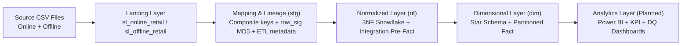
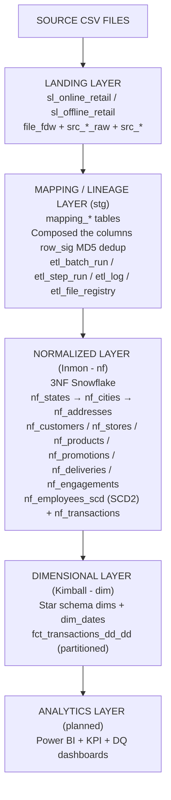
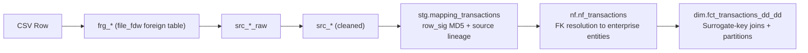
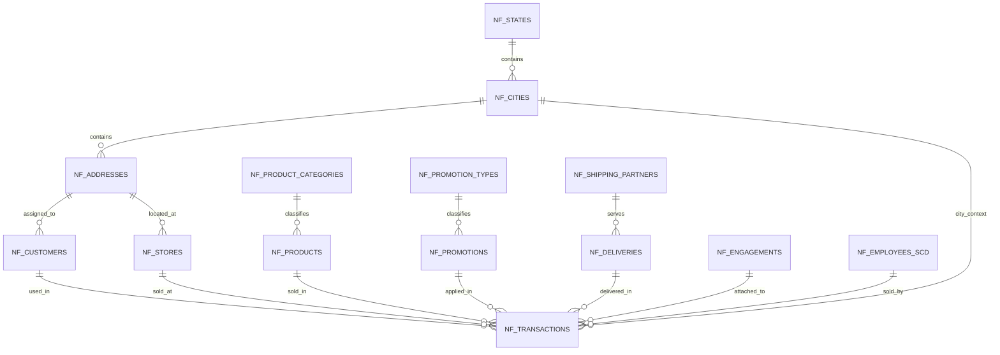
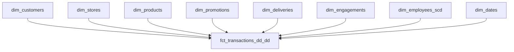
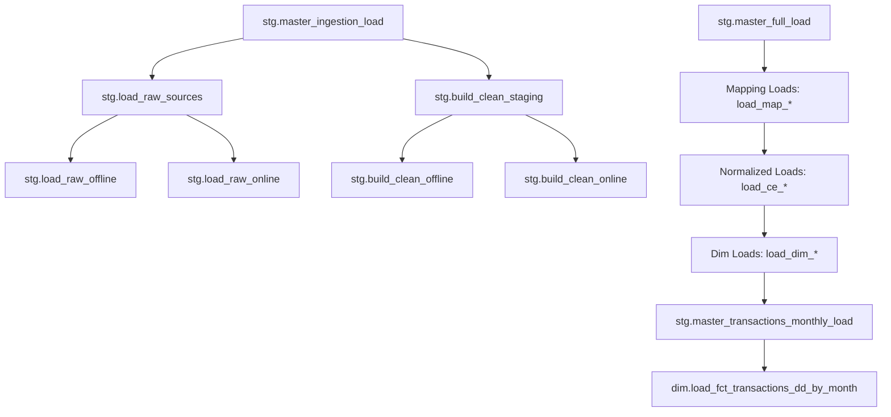
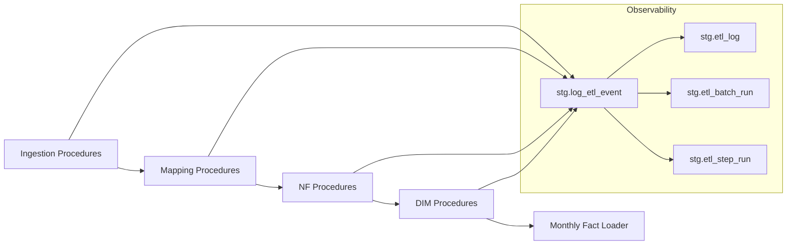
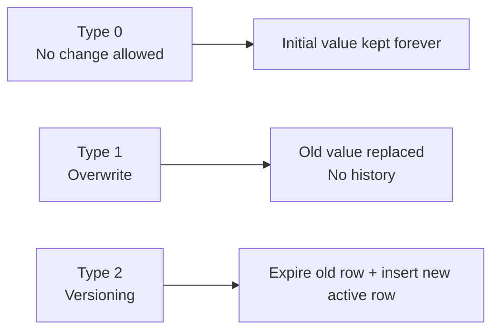
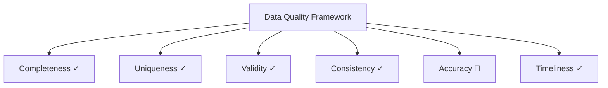

# Retail Data Warehouse Pipeline
### A SQL-Native, End-to-End ELT Data Warehouse — Built on PostgreSQL in Google Colab

This repo documents the core engineering principles that guide the design, development, and evolution of a production-oriented, SQL-heavy(PostgreSQL + PL/pgSQL) ELT (Extract → Load → Transform) Retail Data Warehouse implementation . These principles ensure that the warehouse remains reliable, scalable, maintainable, and production-ready.

> **Status:** Active development · Bulk load complete · Incremental load tested · Data quality layer in progress  
> **Stack:** PostgreSQL 14 · PL/pgSQL · Google Colab · file_fdw · Python (setup only)  
> **Architecture:** Hybrid Inmon-Kimball (Corporate Information Factory model)

---

## Table of Contents

1. [Project Overview](#1-project-overview)
2. [Why This Project Exists](#2-why-this-project-exists)
3. [Core Engineering Principles](#3-key-concepts)
4. [Architecture Overview](#4-architecture-overview)
5. [Data Flow Diagram](#5-data-flow-diagram)
6. [Layer Responsibilities](#6-layer-responsibilities)
7. [Key Strategy, Lineage, and Deduplication](#6-key-strategy-lineage-and-deduplication)
8. [Entity-Relationship Diagrams](#7-entity-relationship-diagrams)
9. [Star Schema & Bus Matrix](#8-star-schema--bus-matrix)
10. [Pipeline Orchestration, Logging, and Batch Logic Flow](#9-pipeline-orchestration-flow)
11. [SCD Strategy by Entity](#10-scd-strategy-by-entity)
12. [Data Quality&Governance, Integrity, and Join Strategy ](#11-data-quality--governance-framework)
13. [Performance and Indexing Strategy](#12-performance-and-indexing-strategy)
14. [Design Decisions](#12-design-decisions)
15. [Project Roadmap](#13-project-roadmap)
16. [How to Run](#14-how-to-run)
17. [Repository Structure](#15-repository-structure)

---

## 1. Project Overview

This project implements a production-grade, SQL-native ELT data warehouse pipeline using PostgreSQL and PL/pgSQL only. All business transformation logic is handled inside the database engine, not in the BI layer and not in an external transformation framework. This keeps the warehouse as the single source of truth and makes transformation logic auditable, rerunnable, and reusable.

The dataset consists of **two synthetic retail CSV files** (500,000 rows each): one representing online retail transactions, one representing offline (in-store) transactions. Both sources are transaction-grained — every row is one sales event.

The pipeline includes:
- **Source-specific landing schemas** for raw ingestion and standardization
- A **mapping / lineage layer** for source triplet preservation, business-key handling, composite key derivation, and low-cost downstream joins
- A **3NF normalized layer** as the integrated enterprise warehouse
- A **star schema** for analytics and reporting
- A **logging and orchestration framework** for ETL observability
- **SCD Type 0, 1, and 2** handling based on entity semantics
- **Default row strategy, referential integrity preservation,** and **incremental-safe reruns**
- **Partitioning and indexing strategy** for scalable query performance



---

## 2. Why This Project Exists

Many data warehouse tutorials show final tables but skip the hard parts that make enterprise pipelines reliable: source lineage, natural key ambiguity, row-level deduplication, referential integrity, SCD handling, rerunnable scripts, logging, and performance-aware join design. This project was built to make those decisions explicit.

**Building it this way forces a deeper understanding of what tools like dbt, Snowflake, and Airflow are actually abstracting away.**

---

## 3. Core Engineering Principles

** Rerunnable by design**

All SQL objects and procedures are written to be safely executed multiple times. This is implemented through patterns such as:

`CREATE ... IF NOT EXISTS`
controlled `DROP ... IF EXISTS`
`TRUNCATE + INSERT` for snapshot-style bulk loads
`WHERE NOT EXISTS`, `LEFT JOIN ... IS NULL`, and `ON CONFLICT DO NOTHING` for incremental-safe inserts

The goal is simple: the pipeline must not require manual cleanup before being executed again. This reduces duplication, lowers operational risk, and makes testing idempotency measurable.

**Reusable by architecture**

The warehouse is intentionally layered so that each part has one responsibility only:

landing = ingestion and standardization
mapping = semantic alignment and lineage
normalized = entity resolution and business constraints
dimensional = analytics-ready facts and dimensions
operational utilities = orchestration, logs, and observability

This separation prevents business logic from leaking into BI and reduces overcoding in later layers.

**Deduplicate mindset**

Deduplication is not treated as a single SQL statement but as a warehouse-wide mindset. Source inconsistencies were first reduced in landing through standardization, then protected in mapping and downstream loads through deterministic exclusion logic and row signatures. In other words, duplicates are handled as early as possible, but also guarded again at later layers so the design does not rely on one fragile checkpoint.

**Data integrity first**

Natural keys are identified early, but surrogate keys are generated only in the normalized warehouse. This makes business-key ambiguity visible before entity resolution and helps preserve both correctness and lineage. Referential integrity is protected through controlled foreign-key resolution and default rows, so facts remain loadable without silently losing records.

## 4. Architecture Overview

This project follows a Hybrid Inmon-Kimball approach:

- **Landing schemas** keep raw ingestion isolated per source system
- **Mapping tables** unify semantic rules and preserve lineage
- **3NF (nf)** acts as the integrated enterprise model
- **Dimensional (dim)** publishes reporting-friendly stars and facts



A key architectural choice is the **schema-per-source-system** landing design. Each dataset is ingested into its own landing schema first, instead of mixing sources too early. This makes source-specific parsing, standardization, and troubleshooting easier before semantic alignment begins.

**Diagram above is GitHub-native Mermaid and replaces the previous image placeholder.**

---

## 5. Data Flow Diagram



### Ingestion modes

**Bulk load (initial):**  
Bulk loads use a persisted snapshot pattern based on `TRUNCATE + INSERT`, making them rerunnable and operationally simple for large flat-file ingestion.`

**Incremental load:**  
Incremental loads use deterministic exclusion logic such as `WHERE NOT EXISTS`, anti-join patterns, row signature checks, and entity-specific SCD rules to ensure repeated runs do not create unwanted duplicates.

---

## 6. Layer Responsibilities

| Layer | Schema | Purpose | What it does | Load Strategy |
|---|---|---|---|---|
| **Landing — Online** | `sl_online_retail` | Raw ingestion and standardization | file_fdw, raw copy, parsing, controlled NULL handling, standardization, early duplicate reduction --> `frg_online_retail` (foreign), `src_online_retail_raw`, `src_online_retail` | Full reload via file_fdw; standardization via CREATE TABLE AS |
| **Landing — Offline** | `sl_offline_retail` | Raw ingestion and standardization | Same pattern as online source --> `frg_offline_retail` (foreign), `src_offline_retail_raw`, `src_offline_retail` | Full reload via file_fdw; standardization via CREATE TABLE AS |
| **Mapping / Lineage** | `stg` |Semantic alignment and source traceability --> Entity lineage, key derivation, pipeline control | source-to-target mapping, composite key preparation, lineage preservation, row signatures, orchestration metadata--> `mapping_customers`, `mapping_transactions` (+ 6 others), `etl_batch_run`, `etl_log` | Incremental insert with NOT EXISTS; MD5 row_sig for transactions |
| **Normalized (Inmon)** | `nf` | 3NF integration layer, single source of truth | surrogate keys, entity resolution, referential integrity, SCD behavior, business constraints --> `nf_customers`, `nf_products`, `nf_employees_scd`, `nf_transactions` | SCD Type 0/1/2 per entity; surrogate keys via sequences |
| **Dimensional (Kimball)** | `dim` | Star Schema/analytics/reporting layer | dimensions, fact tables, date dimension, partitioned reporting model --> `dim_customers`, `fct_transactions_dd_dd` | Mirror from NF; monthly range partitions on fact |

This separation is intentional: landing cleans, mapping aligns, 3NF resolves, dimensional serves analytics.
---

## 7. Entity-Relationship Diagrams

**Source triplet and data lineage**
A core design principle is the preservation of the **full source triplet**:

- `*_src_id`
- `source_system`
- `source_table`

The same entity can appear in multiple datasets, so joining only on an ID is unsafe. The source triplet preserves lineage and makes the model auditable across online and offline data. It also supports debugging, reconciliation, and controlled incremental logic.

**Business keys vs derived source identifiers**

Business keys are identified early because they drive:

- deduplication
- incremental logic
- SCD handling
- source-to-target lineage

However, profiling showed that raw business keys are not always reliable enough to represent real-world uniqueness across both sources. For that reason, row uniqueness is often defined through **derived** `*_src_id` **combinations**, while original business keys are still preserved for lineage.

**Why the mapping layer matters**

The mapping layer exists not only for lineage, but also to reduce cost in the normalized load. Instead of repeatedly rebuilding the same key combinations in 3NF procedures, composite identifiers and source-aligned business columns are prepared once in mapping tables. This makes downstream joins cheaper, simpler, and less error-prone. It is effectively a **“be ready with combinations of columns”** strategy to avoid overcoding the 3NF layer.

**Deduplication implementation**
Deduplication is applied with multiple controls:

- standardization in `src_*` tables
- `SELECT DISTINCT` / deterministic row cleansing where appropriate
- `ROW_NUMBER()`-based protection for downstream uniqueness when needed
- `WHERE NOT EXISTS`
- `LEFT JOIN ... IS NULL`
- `ON CONFLICT DO NOTHING`
- `row_sig` MD5 signature for transaction-level duplicate protection

This layered strategy keeps deduplication explicit and measurable rather than assumed.

## 8. Entity-Relationship Diagrams
### Snowflake Schema (nf layer — Inmon)


The model is designed as a unified warehouse for both retail sources, so ERD and star schema decisions follow the rule that the same entity, when present in multiple sources, must still be representable in one integrated target structure with preserved lineage.
Key FK chains in the snowflake schema:

```
nf_states (state_id PK)
    └── nf_cities (state_id FK)
            └── nf_addresses (city_id FK)
                    ├── nf_customers (address_id FK)
                    └── nf_stores   (address_id FK)

nf_product_categories (product_category_id PK)
    └── nf_products (product_category_id FK)

nf_promotion_types (promotion_type_id PK)
    └── nf_promotions (promotion_type_id FK)

nf_shipping_partners (shipping_partner_id PK)
    └── nf_deliveries (shipping_partner_id FK)

nf_transactions → nf_customers, nf_products, nf_promotions,
                   nf_deliveries, nf_engagements, nf_stores,
                   nf_cities, nf_employees_scd (8 FKs)
```

### Star Schema (dim layer — Kimball)



---

## 9. Star Schema & Bus Matrix

### Dimensions

| Dimension | Surrogate Key | Key Attributes | SCD Type |
|---|---|---|---|
| `dim_customers` | `customer_surr_id` | gender, marital_status, city, state, zip, membership_dt | Type 1 |
| `dim_products` | `product_surr_id` | category, name, brand, material, stock, manufacture_dt | Type 1 |
| `dim_promotions` | `promotion_surr_id` | type, channel, start_dt, end_dt | Type 0 |
| `dim_deliveries` | `delivery_surr_id` | type, status, shipping_partner | Type 0 |
| `dim_engagements` | `engagement_surr_id` | order_channel, support_method, issue_status, app_usage | Type 0 |
| `dim_stores` | `store_surr_id` | name, location, city, state, zip | Type 0 |
| `dim_employees_scd` | `employee_surr_id` | name, position, salary, hire_date, start_dt, end_dt, is_active | Type 2 |
| `dim_dates` | `date_surr_id` | full_date, day_name, month_name, quarter, week, is_weekend | Static |

### Fact Table

| Table | Grain | Measures | Partition |
|---|---|---|---|
| `fct_transactions_dd_dd` | One row = one retail transaction | total_sales, quantity, unit_price, discount_applied | Monthly RANGE by transaction_date |

### Bus Matrix (Business Process × Dimensions)

| Business Process | Customer | Product | Promotion | Delivery | Engagement | Store | Employee | Date |
|---|:---:|:---:|:---:|:---:|:---:|:---:|:---:|:---:|
| **Online Sale** | ✓ | ✓ | ✓ | ✓ | ✓ | — | — | ✓ |
| **Offline Sale** | ✓ | ✓ | ✓ | ✓ | — | ✓ | ✓ | ✓ |
| **Combined (unified fact)** | ✓ | ✓ | ✓ | ✓ | ✓ | ✓ | ✓ | ✓ |

> Note: Online transactions carry `engagement_id` (digital behavior); offline transactions carry `store_id` and `employee_id`. Rows without a valid FK resolve to the `-1` sentinel (unknown) dimension row, preserving referential integrity without data loss.
> **Date table strategy:** The date dimension is treated as a special warehouse dimension. Unlike other dimensions, it is not populated from the normalized layer.
> **Granularity awareness **
The fact table grain is explicitly defined as one row = one retail transaction.

---

## Pipeline Orchestration, Logging, and Batch Logic

The pipeline is orchestrated through PL/pgSQL stored procedures that separate ingestion, standardization, mapping, normalized load, and dimensional load.



Every procedure call is logged to `stg.etl_log` via `stg.log_etl_event()`. Every batch is tracked in `stg.etl_batch_run` and `stg.etl_step_run`.


**Log table purpose**

The log tables are not decorative metadata; they are operational controls. They record:

- which procedure ran
- when it ran
- batch and step identifiers
- rows read / inserted / updated
- status and error details

This makes ETL behavior testable and supports the idempotency requirement: re-running the same procedure with the same source data should produce either zero new rows or an explicitly justified result for snapshot reloads.

**Batch logic**

A batch represents one controlled execution unit of the pipeline. It groups multiple ETL steps under one run context so the process becomes traceable end to end. In practice, batch logic is what allows the warehouse to answer questions like:

- Which file set was loaded together?
- Which step failed?
- How many rows were read vs loaded?
- Was this a bulk reload or an incremental run?

Without batch control, logs stay fragmented; with it, the pipeline becomes operationally auditable.

**Exception block and SQLERRM**

Every procedure should include a controlled BEGIN ... EXCEPTION ... END block. The purpose is not only to catch failure, but to preserve observability and keep the pipeline diagnosable. In this context:

- `SQLERRM` returns the textual database error message
- `GET STACKED DIAGNOSTICS` captures deeper diagnostic context
- `RAISE NOTICE` / `RAISE EXCEPTION` make failure visible and structured

This is essential for log tables, troubleshooting, and preventing silent partial failures.

Transaction safety

Multi-step loads must be executed with transaction awareness. When a load must behave atomically, partial writes are not acceptable. The general pattern is:

BEGIN;
-- ETL steps
COMMIT;
-- on failure: ROLLBACK;
This protects the warehouse from being left in an inconsistent state after a failed step.
---

## 11. SCD Strategy by Entity

Slowly Changing Dimensions (SCD) define how changes in source data are handled in the warehouse. This project applies three strategies based on the business nature of each entity.

| Entity | SCD Type | Rationale |
|---|---|---|
| `nf_states` | **Type 0** | Geographic reference — never changes |
| `nf_cities` | **Type 0** | Geographic reference — never changes |
| `nf_addresses` | **Type 0** | Zip+city+state combination — treated as static identifier |
| `nf_shipping_partners` | **Type 0** | Logistics partner name — stable reference |
| `nf_promotion_types` | **Type 0** | Enum-like reference — stable |
| `nf_product_categories` | **Type 0** | Category taxonomy — stable |
| `nf_stores` | **Type 0** | Physical store location — no versioning required in this dataset |
| `nf_deliveries` | **Type 0** | Delivery type + partner combination — treated as static lookup |
| `nf_promotions` | **Type 0** | Promotion events — treated as immutable once loaded |
| `nf_customers` | **Type 1** | Customer attributes overwrite — latest state is sufficient for this use case |
| `nf_products` | **Type 1** | Product attributes overwrite — stock levels update in place |
| `nf_employees_scd` | **Type 2** | Salary and position changes must be historically tracked (each change creates a new version with `start_dt`, `end_dt`, `is_active`) |

**SCD handling and upsert mindset**
SCD logic is not treated as a generic merge shortcut. Type 1 entities use overwrite-style logic where business meaning allows it, while Type 2 entities use controlled versioning with:

- `start_dt`
- `end_dt`
- `is_active`

This is effectively an **UPSERT-by-business-rule** pattern, not a blind technical upsert. For Type 2, the old row is expired and a new active row is inserted.



---

### 12. Data Quality & Governance, Integrrity, and Join Strategy 

**Referential integrity and default rows**
Every main target table includes a default row strategy. Standard pattern:

- surrogate key = -1
- descriptive attributes = 'N/A'

This prevents fact loads from breaking when a dimension lookup fails. Instead of dropping the transaction, the warehouse preserves the row and routes the unresolved reference to the unknown member. This protects referential integrity without sacrificing **data retention**.

**Deterministic NULL handling**
NULLs are handled intentionally, not passively:

- text defaults use `'n.a.'`
- numeric / ID defaults use `-1`
- date defaults use warehouse-defined boundary dates where appropriate
- `COALESCE` is used when a stable default is required
- explicit `IS NULL` checks are used when business meaning depends on absence

This avoids uncontrolled NULL propagation into aggregations and reporting.

**Left join strategy and why**
In the 3NF layer, `LEFT JOIN` **is preferred intentionally** because row preservation matters more than forcing perfect match completeness during integration. Using only INNER JOIN in enterprise integration can silently discard valid source rows whose reference lookup is still unresolved. The warehouse should preserve the business event first and then resolve unmatched dimensions through default-row logic if needed.

**Semi join and anti join**
Two important logical patterns are used in the project even when implemented through PostgreSQL-friendly SQL forms:

- **Semi join purpose:** check whether a matching row exists, without multiplying rows from the matched table. In practice, this is commonly implemented using `EXISTS`. It is useful for validation, controlled filtering, and incremental selection.
- **Anti join purpose:** find rows that do not yet exist in the target. In practice, this is implemented with `WHERE NOT EXISTS` or `LEFT JOIN ... IS NULL`. It is essential for rerunnable incremental loads and duplicate prevention.

These patterns are important because they support idempotency more safely than over-reliance on broad DISTINCT logic alone.

**Data type discipline**
Raw ingestion can temporarily use flexible types, but normalized and dimensional layers enforce explicit typing:

`DATE` for dates
`NUMERIC` for measures
`BIGINT` / integer types for identifiers
`BOOLEAN` where appropriate

Strong typing improves correctness, aggregations, and BI predictability.
### DQ Dimensions

| Dimension | Description | Expectation | Status |
|---|---|---|---|
| **Completeness** | No required fields are null or empty | All NOT NULL columns populated; `COALESCE(NULLIF(...), 'n.a.')` applied at staging | ✓ Enforced at standardization |
| **Uniqueness** | No duplicate records at the declared grain | `row_sig` MD5 deduplication on transactions; `NOT EXISTS` guards on all entity inserts | ✓ Enforced at mapping layer |
| **Validity** | Values conform to expected formats and ranges | Regex-based date format validation (`DD-MM-YYYY`, `DD/MM/YYYY`); numeric cast guards | ✓ Enforced at standardization |
| **Consistency** | Cross-source values agree (same entity described the same way) | Composite key derivation standardizes attributes before joining across online/offline sources | ✓ Enforced at mapping layer |
| **Accuracy** | Values reflect real-world truth | Synthetic dataset — business logic anomalies documented; pipeline correctness verified | 🔄 Test cases in progress |
| **Timeliness** | Data is available within acceptable time windows | Batch timestamps tracked in `etl_batch_run`; `load_dts` and `insert_dt` on every row | ✓ Tracked; SLA not yet formalized |



### MD5 Row Signature Logic

The `row_sig` column on `mapping_transactions` is a content-based fingerprint:

```sql
row_sig = MD5(
    source_system || '|' ||
    source_table  || '|' ||
    transaction_id || '|' ||
    transaction_dt::TEXT || '|' ||
    customer_id || '|' ||
    product_id || '|' ||
    promotion_id || '|' ||
    delivery_id || '|' ||
    engagement_id_or_employee || '|' ||
    promotion_start_dt::TEXT || '|' ||
    promotion_end_dt::TEXT
)
```

A unique index on `row_sig` enforces deduplication at the database level. Any re-run of the pipeline with the same source data produces zero new inserts — making the pipeline fully **idempotent**.

### Data Governance

Role-based access control is defined in `sql/06_security/`:

| Role | Schemas Accessible | Permissions |
|---|---|---|
| `retail_analyst` | `dim`, `nf` | SELECT only |
| `retail_etl_runner` | All schemas | SELECT, INSERT, UPDATE, EXECUTE procedures |
| `retail_dba` | All | Full privileges |

An `stg.security_audit_log` table tracks DML operations for sensitive tables.

---

## 13. Performance and Indexing Strategy
Performance is considered explicitly, not assumed. The goal is not “fast at any cost,” but correct first, then measurable optimization.

### Indexing strategy
Indexes are created intentionally around warehouse access patterns. In particular:

- source lineage columns such as src_id, source_system, and source_table are indexed where needed because they are frequently used in joins and incremental validation
- fact tables use date-oriented indexing and partitioning
- lookup and foreign-key access paths are supported with targeted indexes
- indexing is used to support join cost reduction, not as a substitute for poor SQL design

### Why this matters 

Because the model preserves lineage and uses layered joins, indexing is needed to keep:

- incremental checks efficient
- FK lookups stable
- SCD comparisons faster
- partition-pruned fact access practical
- Partitioning and large-table considerations

### Partitioning and large-table considerations
The fact table is range-partitioned by month. This supports partition pruning for time-bound queries and reduces unnecessary scans on large transaction volumes. For ordered date workloads, lightweight index choices such as **BRIN** are appropriate, while entity and join lookups may still benefit from **B-tree** indexes.

### Controlled ID generation

Generated identifiers use **explicit sequences**, not SERIAL. This improves transparency, predictability, and migration flexibility. Surrogate keys are introduced in the warehouse layers deliberately, rather than being mixed into early raw ingestion.
---

## 14. Design Decisions

**Why file_fdw?**
`file_fdw` lets PostgreSQL read CSV files as **foreign tables**, meaning flat files become queryable through SQL before physical loading. This is both theoretically clean and practically useful in a constrained environment such as Colab. It also supports a rerunnable ingestion setup because file definitions can be recreated or repointed without rewriting the entire ingestion logic.

**Why source-specific landing schemas?**
Because online and offline datasets share some business entities but still arrive from different operational contexts. Keeping them separate at first makes cleansing and source-aware debugging easier, while later mapping tables bring them into a unified warehouse shape.

**Why preserve original business keys if they are unreliable?**
Because lineage and uniqueness are different concerns. Original business keys remain valuable for traceability and audit, even when they are not reliable enough to drive warehouse-level deduplication. For that reason, the model preserves them descriptively while using stronger derived identifiers and warehouse surrogate keys for integration and fact joins.

**Why no hardcoded business logic in BI?**
Power BI should consume modeled data, not redefine core transformation rules. If business logic lives outside the warehouse, the warehouse stops being the single source of truth. This project keeps business logic inside SQL layers intentionally.


## 15. Project Roadmap

### Completed ✓
- [x] Bulk ingestion pipeline (475k rows per source)
- [x] Incremental ingestion pipeline (+25k rows per source)
- [x] Standardization / type casting at landing layer
- [x] Entity-by-entity mapping with composite key derivation
- [x] 3NF Snowflake Schema (nf layer) — 13 tables
- [x] Star Schema (dim layer) — 7 dimensions + monthly partitioned fact table
- [x] SCD Type 2 for employees (versioning with history)
- [x] MD5 row_sig deduplication
- [x] Orchestration metadata (batch, step, log, file registry)
- [x] Default sentinel rows for referential integrity
- [x] Role-based security layer

### In Progress 🔄
- [ ] Data quality test cases (6-dimension DQ framework)
- [ ] Bug fix: SCD2 duplicate key on incremental employee load
- [ ] Bug fix: `etl_batch_run.rows_read` / `rows_loaded` not populated
- [ ] Entity-level profiling markdown files

### Planned 📋
- [ ] KPI definitions and analytical views (`dim.v_monthly_sales`, `dim.v_customer_360`)
- [ ] Power BI dashboard — connected via DirectQuery
- [ ] GENERATED ALWAYS AS computed columns in dim_dates (fiscal_quarter, season)
- [ ] dbt version: same pipeline rewritten using `ref()`, tests, and YAML contracts
- [ ] Cloud version: BigQuery or Snowflake migration track

---

## 16. How to Run

### Prerequisites
- Google Colab 
- Google Drive
- CSV files mounted into the expected folder path
  This is in my case. Otherwise, PostgreSQL, pgAdmin, DBeaver, Python used initially.

### File naming convention
```
01_empty_95_off.csv   ← Offline bulk (475k rows)
02_empty_95_on.csv    ← Online bulk  (475k rows)
03_empty_5_off.csv    ← Offline incremental (25k rows)
04_empty_5_on.csv     ← Online incremental  (25k rows)
```

## 17. ABBREVATIONs

| Term | Definition | Used in This Project |
|---|---|---|
| **ELT** | Extract → Load → Transform. Data lands raw first; all transformation happens inside the target DB engine. | Full pipeline pattern. Raw CSV → PostgreSQL → transformation in PL/pgSQL |
| **ETL** | Extract → Transform → Load. Transformation happens outside the DB before loading. | Not used here — distinguished intentionally |
| **file_fdw** | PostgreSQL foreign data wrapper that maps a CSV file to a virtual table (foreign table) queryable with SQL. | Used to ingest online and offline CSV files as `frg_online_retail` and `frg_offline_retail` |
| **Staging Layer** | A landing zone that holds raw + standardized source data before business logic is applied. | `sl_online_retail` and `sl_offline_retail` schemas |
| **Data Integration** | Combining data from multiple source systems into a unified structure. | UNION ALL of online and offline sources in mapping procedures |
| **Source Key (NK)** | The natural key from the source system (e.g. `customer_id` from the CSV). Also called Natural Key. | Stored as `*_id_nk` in mapping tables |
| **Composite Key** | A surrogate key derived by concatenating multiple attributes where no single reliable NK exists. | `customer_src_id = gender + marital_status + dob + zip + city + state` |
| **Surrogate Key** | A system-generated integer key used as the primary key in normalized and dimensional layers. | All `nf.*` and `dim.*` tables use BIGINT surrogates via sequences |
| **SCD Type 0** | Fixed — once loaded, values never change. | `nf_stores`, `nf_deliveries`, `nf_promotions` |
| **SCD Type 1** | Overwrite — new values replace old values. No history kept. | `nf_customers`, `nf_products` |
| **SCD Type 2** | Versioning — each change creates a new row with `start_dt`, `end_dt`, `is_active`. History is preserved. | `nf_employees_scd`, `dim_employees_scd` |
| **3NF (Snowflake Schema)** | Third Normal Form. Each table stores facts about one entity only; related data is in separate tables joined by FK. | `nf` schema — 13 tables with FK hierarchy |
| **Star Schema** | Denormalized dimensional model. Dimension attributes are flattened into wide tables around a central fact. | `dim` schema — 7 dimensions + 1 partitioned fact table |
| **Inmon CIF** | Corporate Information Factory. Bill Inmon's methodology: build a normalized enterprise DWH first, then derive data marts. | `nf` schema mirrors the CIF integration layer |
| **Hybrid Inmon-Kimball** | Architecture that maintains both a 3NF integration layer (Inmon) and Star Schema data mart (Kimball). | Exact architecture of this project |
| **Data Profiling** | Statistical analysis of source data to understand distribution, nullability, uniqueness, and grain. | Performed post-standardization to validate entity grain |
| **Data Quality (DQ)** | Fitness of data for its intended use, measured across 6 dimensions. | DQ framework defined — test implementation in progress |
| **Data Governance** | Policies, roles, and controls that ensure data is managed responsibly. | GRANT/REVOKE role-based access control defined; audit log table created |
| **MD5 Row Signature** | An MD5 hash of key fields used as a duplicate-detection fingerprint for transaction rows. | `row_sig = MD5(source_system || transaction_id || customer_id || product_id || ...)` |
| **Referential Integrity** | All foreign key references point to a real row — no orphan records. | Default (-1) sentinel rows inserted in all dimension/reference tables before fact load |
| **Range Partitioning** | Splitting a large table by a range of values (e.g. date) so queries only scan relevant partitions. | `fct_transactions_dd_dd` partitioned by `transaction_date` monthly |
| **BRIN Index** | Block Range INdex. Lightweight index for ordered columns in large tables (e.g. dates). | Applied to `transaction_dt` on fact table for time-range query acceleration |
| **Bus Matrix** | A Kimball artifact showing which dimensions participate in which business processes. | See Section 8 |

---

---

## About This Project

This project was built as a portfolio-grade warehouse engineering case focused on explicit design choices rather than hidden abstractions. The main objective was to show how raw files can be turned into a governed analytical model through SQL-native ingestion, standardization, lineage preservation, normalized integration, dimensional modeling, and orchestration.

The constraint-driven setup was intentional: by building under limited infrastructure, the project makes the underlying warehouse principles more visible.

---

*Feedback, issues, and pull requests welcome.*
