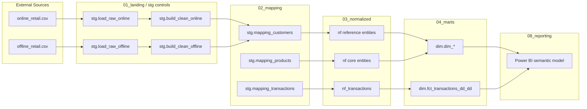
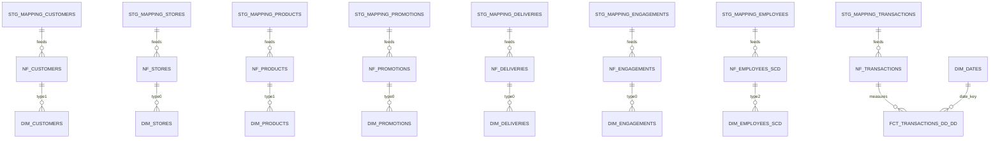
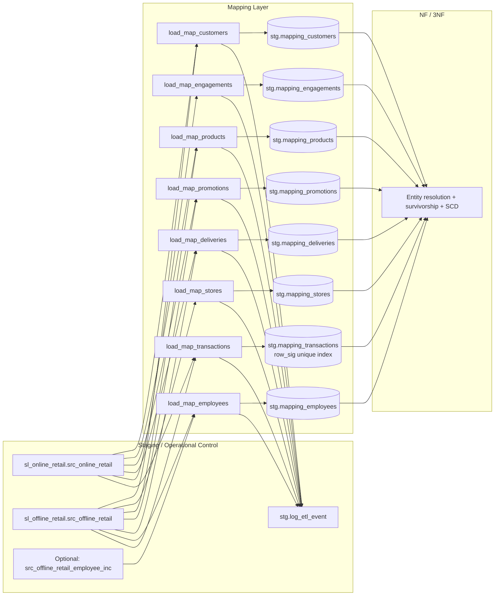
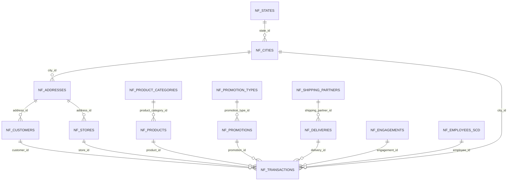
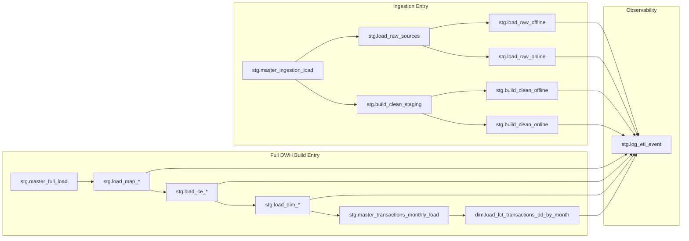
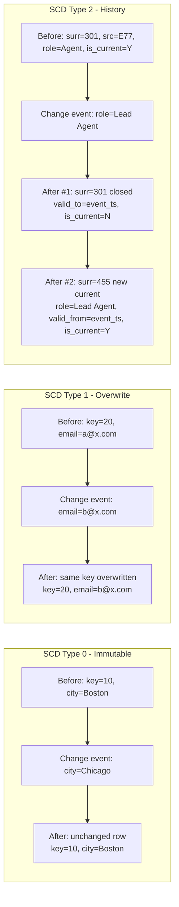
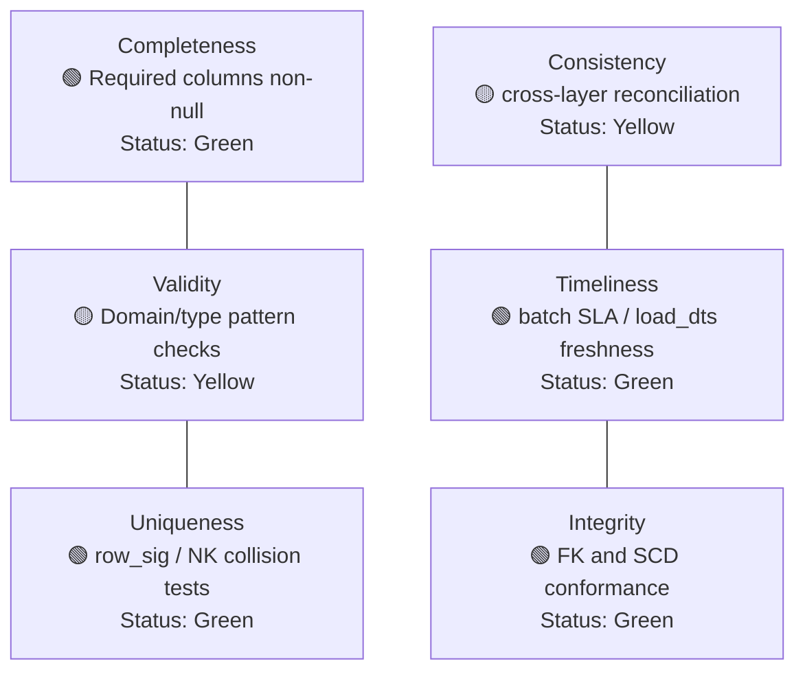

# Mapping Layer — Architectural Design (Visual Playbook)

> This document is a visual-first architecture guide prepared from `sql/01_landing`, `sql/02_mapping`, `sql/03_normalized`, `sql/04_marts`, and `sql/05_orchestrastion` SQL assets. It is intentionally designed as a modern diagram set that can also be exported to PNG from Mermaid-compatible tooling.
## 0) How to use this document

- All diagrams are provided in Mermaid for version control friendliness.
- For PNG delivery, render each diagram in Mermaid Live Editor, draw.io, dbdiagram.io, pgAdmin ERD, or your CI docs renderer and export as PNG.
- Diagram order follows end-to-end pipeline readability: ingestion → mapping → 3NF → dimensional model → BI/ops/DQ.

---

## 1) Architecture in Pipeline (Flow Visual)


---

## 2) Data Flow Diagram (Single Transaction Journey)

```mermaid
flowchart LR
    classDef data fill:#EEF7FF,stroke:#1976D2,color:#0D47A1;
    classDef proc fill:#E8F5E9,stroke:#2E7D32,color:#1B5E20;
    classDef key fill:#FFF8E1,stroke:#F9A825,color:#6D4C41;
    R1[CSV Row\ntransaction_id + attributes]:::data
    F1[frg_* foreign table row]:::data
    S1[src_raw row\nsl_online_retail/src_offline_retail]:::data
    S2[src_standardized row\nclean typed columns]:::data
    M1[mapping_transactions row\nrow_sig=md5(concat_ws('|',...))]:::key
    N1[nf_transactions row\n8 FK resolution]:::key
    D1[fct_transactions_dd_dd row\njoined by surrogate keys]:::key
    R1 --> F1 --> S1 --> S2 --> M1 --> N1 --> D1
```

---

## 3) Project Architecture Overview (One-page)

```mermaid
flowchart LR
    classDef ext fill:#F5F5F5,stroke:#616161,color:#212121;
    classDef l1 fill:#E3F2FD,stroke:#1565C0,color:#0D47A1;
    classDef l2 fill:#E8F5E9,stroke:#2E7D32,color:#1B5E20;
    classDef l3 fill:#FFF3E0,stroke:#EF6C00,color:#5D4037;
    classDef l4 fill:#F3E5F5,stroke:#8E24AA,color:#4A148C;
    classDef l5 fill:#E0F2F1,stroke:#00695C,color:#004D40;
    SRC[CSV Files\n~475K offline + ~475K online]:::ext --> LND[Schema: sl_* / stg raw-clean\nLanding + Standardization]:::l1
    LND --> MAP[Schema: stg.mapping_*\nSemantic alignment + lineage]:::l2
    MAP --> NF[Schema: nf.*\n13 normalized entities]:::l3
    NF --> DIM[Schema: dim.*\n8 dimensions + fact]:::l4
    DIM --> BI[Power BI\nDashboards + KPI consumption]:::l5
```



---

## 4) Full Architecture Diagram (Horizontal, All Layers)



---

## 5) ERD Diagram (Whole SQL Landscape, High-level)



---

## 6) Professional Architecture Diagram (Mapping-focused)



---

## 7) Snowflake Schema ERD (NF layer, 13 Tables)



---

## 8) Star Schema Diagram (Dim layer — Kimball)

```mermaid
flowchart TB
    F[(dim.fct_transactions_dd_dd)]
    D1[(dim.dim_customers)]
    D2[(dim.dim_stores)]
    D3[(dim.dim_products)]
    D4[(dim.dim_promotions)]
    D5[(dim.dim_deliveries)]
    D6[(dim.dim_engagements)]
    D7[(dim.dim_employees_scd)]
    D8[(dim.dim_dates)]
    D1 -->|customer_surr_id| F
    D2 -->|store_surr_id| F
    D3 -->|product_surr_id| F
    D4 -->|promotion_surr_id| F
    D5 -->|delivery_surr_id| F
    D6 -->|engagement_surr_id| F
    D7 -->|employee_surr_id| F
    D8 -->|date_id (role-playing date keys)| F
```

---

## 9) Pipeline Orchestration Flow (Procedure hierarchy + logs)



---

## 10) Incremental vs Bulk Load Flow (Comparison)

```mermaid
flowchart TB
    subgraph BULK[Bulk Mode]
        B1[Read full online/offline source sets]
        B2[Rebuild full clean staging]
        B3[Run complete mapping load set]
        B4[Run complete nf load set]
        B5[Run full dimensional refresh]
        B6[Monthly fact partition procedure]
        B1 --> B2 --> B3 --> B4 --> B5 --> B6
    end
    subgraph INCR[Incremental Mode]
        I1[Read delta files / inc table]
        I2[Append + merge targeted clean staging]
        I3[Targeted map refresh (entity-specific)]
        I4[Targeted nf upsert / SCD process]
        I5[Dim upsert + monthly fact partition slice]
        I1 --> I2 --> I3 --> I4 --> I5
    end
```

---

## 11) SCD Type 0 / Type 1 / Type 2 Comparison



---

## 12) DQ Framework Diagram (6-cell Grid)



---

## 13) Practical Notes for PNG Exports

1. **Mermaid path (fastest):** paste each code block into Mermaid Live Editor and export PNG.
2. **ERD path (authoritative):** generate NF/table ERD via pgAdmin ERD or dbdiagram.io, then export PNG.
3. **BI-ready images:** keep all outputs in 16:9 format for slide decks and architecture reviews.
4. **Versioning:** keep Mermaid source in git and store generated PNG files under `docs/architecture/`.

---

## 14) Final Design Statement

The mapping layer remains the semantic bridge between staged data and normalized business entities. Its key value is preserving transaction-grain evidence while making source-to-target logic explicit and traceable, so NF/3NF and dimensional layers can resolve entities and analytics safely.
