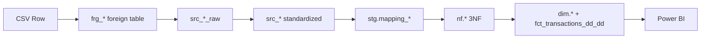
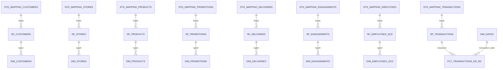
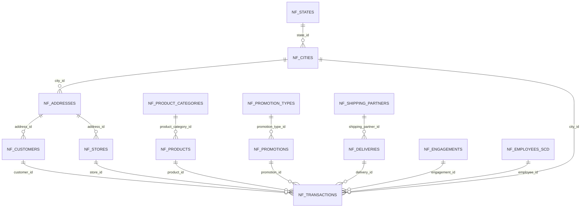
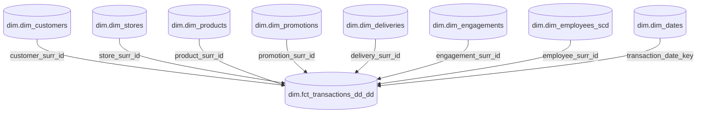

# Retail DWH — Architectural Design PNG Playbook

> Bu doküman, repository içindeki SQL tasarımına (`sql/01_landing` → `sql/05_orchestrastion` → `sql/08_reporting`) birebir uyumlu şekilde, istenen tüm diyagramları **tek yerde**, **analitik sırada**, **PNG çıktısına hazır Mermaid kaynaklarıyla** sunar.

## Diagram Sequencing (Best-Judgement Order)

1. Project Architecture Overview Diagram  
2. Full Architecture Diagram (Horizontal Pipeline)  
3. Architecture in Pipeline (Flow Visual)  
4. Data Flow Diagram (Single Transaction Journey)  
5. Professional Architecture Diagram (Mapping-Focused)  
6. Pipeline Orchestration Flow Diagram  
7. Incremental vs Bulk Load Flow Diagram  
8. ERD Diagram (Whole SQL Landscape, Cross-Layer)  
9. Snowflake Schema ERD (NF 3NF, 13 tables)  
10. Star Schema Diagram (Dim/Kimball)  
11. SCD Type 0 / Type 1 / Type 2 Comparison Diagram  
12. DQ Framework Diagram (6-cell)

---

## 1) Project Architecture Overview Diagram (One-page)

**Suggested PNG output:** `docs/architecture/01_project_architecture_overview.png`

```mermaid
flowchart LR
    classDef src fill:#E3F2FD,stroke:#1565C0,color:#0D47A1;
    classDef lnd fill:#E8F5E9,stroke:#2E7D32,color:#1B5E20;
    classDef map fill:#FFF3E0,stroke:#EF6C00,color:#5D4037;
    classDef nf fill:#F3E5F5,stroke:#8E24AA,color:#4A148C;
    classDef dim fill:#E0F2F1,stroke:#00695C,color:#004D40;
    classDef bi fill:#FCE4EC,stroke:#C2185B,color:#880E4F;

    S[CSV Sources\nonline + offline\n~500K + ~500K rows]:::src
    L[Landing\nsl_online_retail / sl_offline_retail\nfrg_* -> src_*_raw -> src_*]:::lnd
    M[Mapping + Orchestration\nstg.mapping_* + stg.etl_*\nrow_sig lineage + log tables]:::map
    N[NF / 3NF Integration\nnf.* (13 tables)]:::nf
    D[Dimensional / Kimball\ndim.dim_* + dim.fct_transactions_dd_dd]:::dim
    B[Power BI / Reporting]:::bi

    S --> L --> M --> N --> D --> B
```

---

## 2) Full Architecture Diagram (Horizontal, All Schemas)

**Suggested PNG output:** `docs/architecture/02_full_architecture_horizontal.png`

```mermaid
flowchart LR
    subgraph SRC[External CSV]
      C1[online_retail.csv]
      C2[offline_retail.csv]
    end

    subgraph LND[01_landing]
      F1[frg_online_retail]
      F2[frg_offline_retail]
      R1[src_online_retail_raw]
      R2[src_offline_retail_raw]
      S1[src_online_retail]
      S2[src_offline_retail]
    end

    subgraph MAP[02_mapping / stg]
      M1[mapping_customers]
      M2[mapping_stores]
      M3[mapping_products]
      M4[mapping_promotions]
      M5[mapping_deliveries]
      M6[mapping_engagements]
      M7[mapping_employees]
      M8[mapping_transactions\n(unique row_sig)]
    end

    subgraph NF[03_normalized / nf]
      N1[nf_states -> nf_cities -> nf_addresses]
      N2[nf_customers / nf_stores / nf_products]
      N3[nf_promotions / nf_deliveries / nf_engagements]
      N4[nf_employees_scd]
      N5[nf_transactions]
    end

    subgraph DIM[04_marts / dim]
      D1[dim_customers]
      D2[dim_stores]
      D3[dim_products]
      D4[dim_promotions]
      D5[dim_deliveries]
      D6[dim_engagements]
      D7[dim_employees_scd]
      D8[dim_dates]
      FCT[fct_transactions_dd_dd\n(monthly partitions)]
    end

    subgraph BI[08_reporting]
      PBI[Power BI Semantic Model]
    end

    C1 --> F1 --> R1 --> S1
    C2 --> F2 --> R2 --> S2
    S1 --> M1 & M3 & M4 & M5 & M6 & M8
    S2 --> M1 & M2 & M3 & M4 & M5 & M7 & M8
    M1 --> N2
    M2 --> N2
    M3 --> N2
    M4 --> N3
    M5 --> N3
    M6 --> N3
    M7 --> N4
    M8 --> N5
    N1 --> N2
    N2 --> D1 & D2 & D3
    N3 --> D4 & D5 & D6
    N4 --> D7
    N5 --> FCT
    D1 --> FCT
    D2 --> FCT
    D3 --> FCT
    D4 --> FCT
    D5 --> FCT
    D6 --> FCT
    D7 --> FCT
    D8 --> FCT
    FCT --> PBI
```

---

## 3) Architecture in Pipeline (Flow Visual)

**Suggested PNG output:** `docs/architecture/03_pipeline_flow_visual.png`



---

## 4) Data Flow Diagram PNG (Single Transaction Journey)

**Suggested PNG output:** `docs/architecture/04_data_flow_single_transaction.png`

```mermaid
flowchart LR
    classDef tx fill:#E8F5E9,stroke:#2E7D32,color:#1B5E20;
    classDef key fill:#FFF8E1,stroke:#F9A825,color:#6D4C41;

    A[CSV transaction row]:::tx --> B[frg_online_retail / frg_offline_retail]:::tx
    B --> C[src_online_retail_raw / src_offline_retail_raw]:::tx
    C --> D[src_online_retail / src_offline_retail]:::tx
    D --> E[mapping_transactions\nrow_sig = md5(...)]:::key
    E --> F[nf_transactions\n8 FK resolution]:::key
    F --> G[fct_transactions_dd_dd\nsurrogate key joins]:::key
```

---

## 5) Professional Architecture Diagram (Mapping-Focused)

**Suggested PNG output:** `docs/architecture/05_mapping_focused_architecture.png`

```mermaid
flowchart LR
    subgraph SRC[Staging Sources]
      S1[sl_online_retail.src_online_retail]
      S2[sl_offline_retail.src_offline_retail]
      S3[src_offline_retail_employee_inc (optional)]
    end

    subgraph MAP[Mapping Procedures + Tables]
      P1[load_map_customers -> mapping_customers]
      P2[load_map_stores -> mapping_stores]
      P3[load_map_products -> mapping_products]
      P4[load_map_promotions -> mapping_promotions]
      P5[load_map_deliveries -> mapping_deliveries]
      P6[load_map_engagements -> mapping_engagements]
      P7[load_map_employees -> mapping_employees]
      P8[load_map_transactions -> mapping_transactions (row_sig)]
    end

    subgraph LOG[Observability]
      L1[stg.log_etl_event]
      L2[stg.etl_batch_run / stg.etl_step_run]
    end

    subgraph NF[NF Loaders]
      N[load_ce_* procedures]
    end

    S1 --> P1 & P3 & P4 & P5 & P6 & P8
    S2 --> P1 & P2 & P3 & P4 & P5 & P7 & P8
    S3 --> P7
    P1 & P2 & P3 & P4 & P5 & P6 & P7 & P8 --> N
    P1 & P2 & P3 & P4 & P5 & P6 & P7 & P8 --> L1 --> L2
```

---

## 6) Pipeline Orchestration Flow Diagram (Swimlane + hierarchy + log)

**Suggested PNG output:** `docs/architecture/06_pipeline_orchestration_flow.png`

```mermaid
flowchart LR
    subgraph INGESTION[Ingestion Lane]
      I0[stg.master_ingestion_load()]
      I1[stg.load_raw_sources()]
      I2[stg.load_raw_offline()]
      I3[stg.load_raw_online()]
      I4[stg.build_clean_staging()]
      I5[stg.build_clean_offline()]
      I6[stg.build_clean_online()]
    end

    subgraph FULL[Full DWH Lane]
      F0[stg.master_full_load()]
      F1[load_map_customers/stores/products/promotions/deliveries/engagements/employees/transactions]
      F2[load_ce_states/cities/addresses/product_categories/promotion_types/shipping_partners]
      F3[load_ce_customers/stores/products/promotions/deliveries/engagements/employees_scd/transactions]
      F4[load_dim_customers/stores/products/promotions/deliveries/engagements/employees_scd/dates]
      F5[stg.master_transactions_monthly_load()]
      F6[dim.load_fct_transactions_dd_by_month()]
    end

    subgraph OBS[Log Lane]
      O1[stg.log_etl_event]
      O2[stg.etl_batch_run]
      O3[stg.etl_step_run]
      O4[stg.etl_file_registry]
    end

    I0 --> I1 --> I2
    I1 --> I3
    I0 --> I4 --> I5
    I4 --> I6

    F0 --> F1 --> F2 --> F3 --> F4 --> F5 --> F6

    I0 --> O1
    I1 --> O2
    I4 --> O3
    I2 --> O4
    I3 --> O4
    F0 --> O1
    F1 --> O3
    F2 --> O3
    F3 --> O3
    F4 --> O3
    F6 --> O1
```

---

## 7) Incremental vs Bulk Load Flow Diagram (Two Swimlanes)

**Suggested PNG output:** `docs/architecture/07_incremental_vs_bulk.png`

```mermaid
flowchart TB
    subgraph BULK[Bulk Mode]
      B1[Load complete CSV files]
      B2[Recreate src_*_raw]
      B3[Rebuild src_* standardized tables]
      B4[Run all mapping procedures]
      B5[Run full nf load (reference + business entities)]
      B6[Run full dim load + monthly fact generation]
      B1 --> B2 --> B3 --> B4 --> B5 --> B6
    end

    subgraph INCR[Incremental Mode]
      I1[Load delta file / inc source]
      I2[Append targeted raw data]
      I3[Apply targeted clean rebuild or merge]
      I4[Selective mapping refresh + row_sig dedupe]
      I5[NF upsert + SCD rules]
      I6[Dim upsert + affected month fact load]
      I1 --> I2 --> I3 --> I4 --> I5 --> I6
    end
```

---

## 8) ERD Diagram (Whole SQL Landscape, Cross-Layer)

**Suggested PNG output:** `docs/architecture/08_cross_layer_erd.png`



---

## 9) Snowflake Schema ERD PNG (NF 3NF, 13 tables)

**Suggested PNG output:** `docs/architecture/09_nf_snowflake_erd.png`



---

## 10) Star Schema (Dim Layer — Kimball)

**Suggested PNG output:** `docs/architecture/10_star_schema_dim.png`



---

## 11) SCD Type 0 / 1 / 2 Comparison Diagram

**Suggested PNG output:** `docs/architecture/11_scd_type_comparison.png`

```mermaid
flowchart LR
    subgraph S0[SCD Type 0 (No Change)]
      A1[Before: store_id=10, store_city=Boston]
      A2[Incoming: store_city=Chicago]
      A3[After: unchanged row remains Boston]
      A1 --> A2 --> A3
    end

    subgraph S1[SCD Type 1 (Overwrite)]
      B1[Before: customer_id=20, marital_status=single]
      B2[Incoming: marital_status=married]
      B3[After: same row updated to married]
      B1 --> B2 --> B3
    end

    subgraph S2[SCD Type 2 (History)]
      C1[Before: emp=E77, role=agent, is_current=Y]
      C2[Incoming: role=lead_agent]
      C3[Old row closed: is_current=N, valid_to=change_ts]
      C4[New row inserted: is_current=Y, valid_from=change_ts]
      C1 --> C2 --> C3 --> C4
    end
```

---

## 12) DQ Framework Diagram (6-cell Grid)

**Suggested PNG output:** `docs/architecture/12_dq_framework_grid.png`

```mermaid
flowchart TB
    A[Completeness\n🟢 Required fields populated\nNull threshold checks]
    B[Validity\n🟡 Type/domain/pattern rules\nDate & numeric format controls]
    C[Uniqueness\n🟢 NK + row_sig duplicate tests\nDedup confidence]
    D[Consistency\n🟡 Cross-layer reconciliation\nsource vs nf vs dim counts]
    E[Timeliness\n🟢 SLA freshness checks\nload_dts monitoring]
    F[Integrity\n🟢 PK/FK + SCD conformance\nUnknown (-1) fallback safety]

    A --- B --- C
    D --- E --- F
```

---

## PNG Production Notes

- Mermaid kaynak kodları version-control dostudur; PNG export için Mermaid Live Editor / draw.io / CI renderer kullanın.
- ERD diyagramlarında (özellikle #8 ve #9) cardinality etiketlerini pgAdmin ERD export ile zenginleştirmeniz tavsiye edilir.
- Önerilen çıktı klasörü: `docs/architecture/`.
- Bu doküman SQL procedure hiyerarşisi ve tablo ilişkileri ile uyumludur; özellikle `stg.master_ingestion_load()` ve `stg.master_full_load()` çağrı zincirleri baz alınmıştır.
