# Retail DWH — Architectural Design PNG Playbook

> Bu doküman, repository içindeki SQL tasarımına (`sql/01_landing` → `sql/05_orchestrastion` → `sql/08_reporting`) birebir uyumlu şekilde, istenen tüm diyagramları **tek yerde**, **analitik sırada**, **PNG çıktısına hazır Mermaid kaynaklarıyla** sunar.

## Diagram Sequencing (Best-Judgement Order)

1. Project Architecture Overview Diagram  
2. Full Architecture Diagram (Horizontal Pipeline)  
3. Architecture in Pipeline (Flow Visual)  
6. Pipeline Orchestration Flow Diagram  
8. ERD Diagram (Whole SQL Landscape, Cross-Layer)  
9. Snowflake Schema ERD (NF 3NF, 13 tables)  
10. Star Schema Diagram (Dim/Kimball)  
11. SCD Type 0 / Type 1 / Type 2 Comparison Diagram  
12. DQ Framework Diagram (6-cell)
13. (In Progress..) AI Automation & Agentic Workflow Diagram (DWH-Centric)

---

## 1) Project Architecture Overview Diagram (One-page)

**Suggested PNG output:** `docs/architecture/01_project_architecture_overview.png`

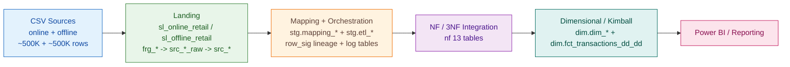

---

## 2) Full Architecture Diagram (Horizontal, All Schemas)

**Suggested PNG output:** `docs/architecture/02_full_architecture_horizontal.png`

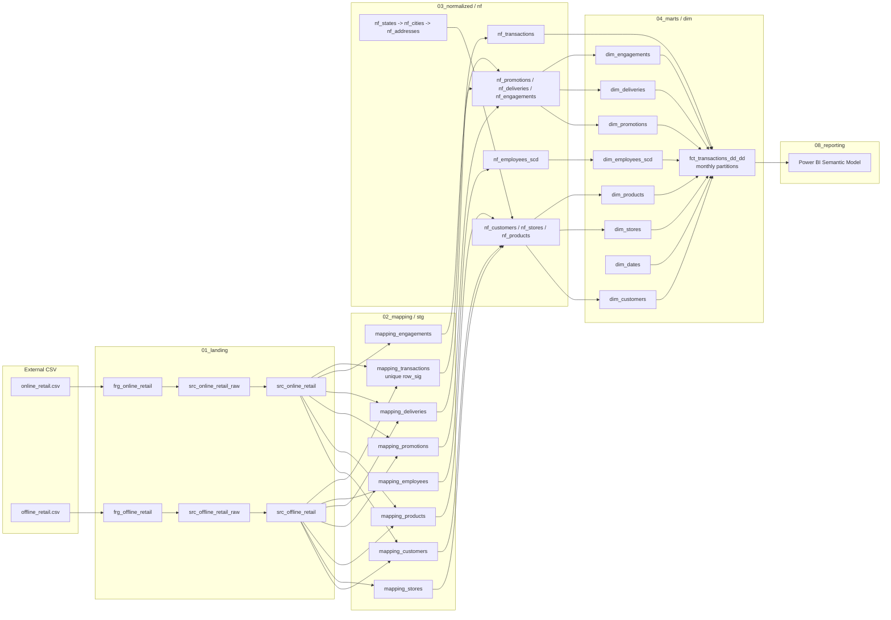

---

## 3) Architecture in Pipeline (Flow Visual)

**Suggested PNG output:** `docs/architecture/03_pipeline_flow_visual.png`

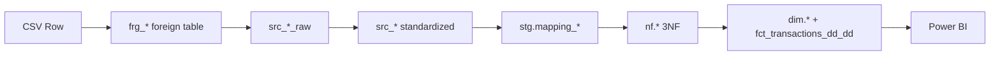

## 6) Pipeline Orchestration Flow Diagram (Swimlane + hierarchy + log)

**Suggested PNG output:** `docs/architecture/06_pipeline_orchestration_flow.png`

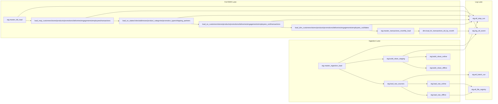

## 8) ERD Diagram (Whole SQL Landscape, Cross-Layer)

**Suggested PNG output:** `docs/architecture/08_cross_layer_erd.png`

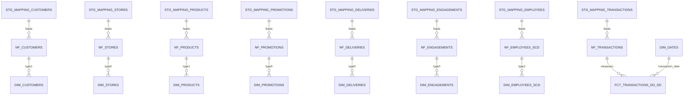

---

## 9) Snowflake Schema ERD PNG (NF 3NF, 13 tables)

**Suggested PNG output:** `docs/architecture/09_nf_snowflake_erd.png`

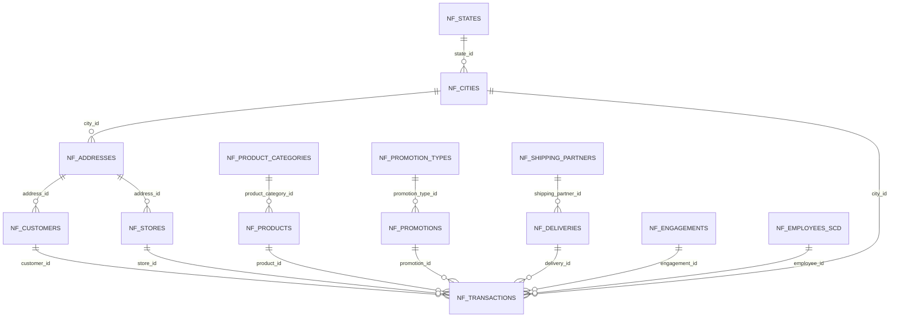

---

## 10) Star Schema (Dim Layer — Kimball)

**Suggested PNG output:** `docs/architecture/10_star_schema_dim.png`

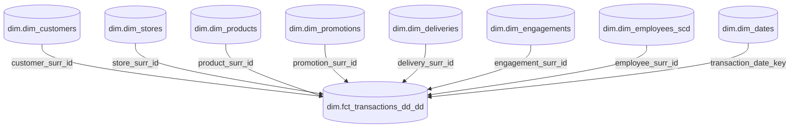

---

## 11) SCD Type 0 / 1 / 2 Comparison Diagram

**Suggested PNG output:** `docs/architecture/11_scd_type_comparison.png`

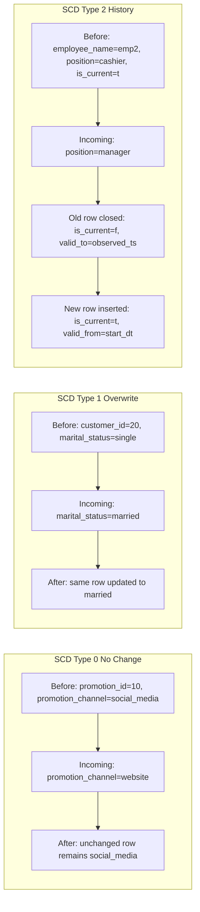

---

## 12) DQ Framework Diagram (6-cell Grid)

**Suggested PNG output:** `docs/architecture/12_dq_framework_grid.png`

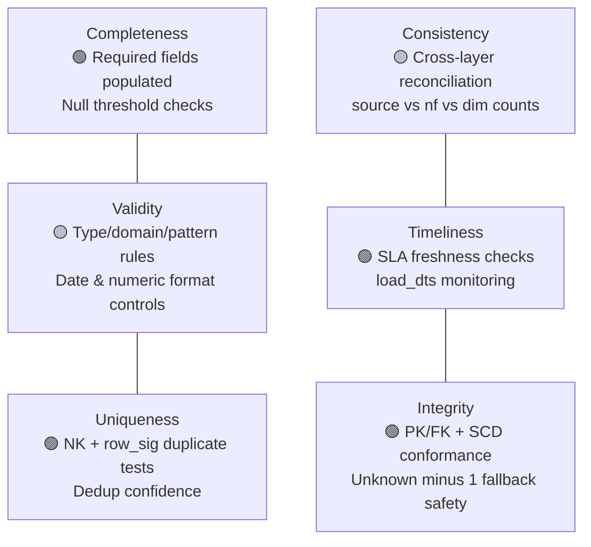

---

## 13) AI Automation & Agentic Workflow Diagram (DWH-Centric)

**WORK IN PROGRESS:** 

> Aim: Wrapping the existing DWH Pipeline (landing → mapping → nf → dim → reporting) up witth AI-native automation system design, which works with human (human--in-the-loop, hooks -preHook, postHook, guards .. etc), catching the anomalies, self-healing orchestration, strengthening built-in agents and task specific sub-agents.

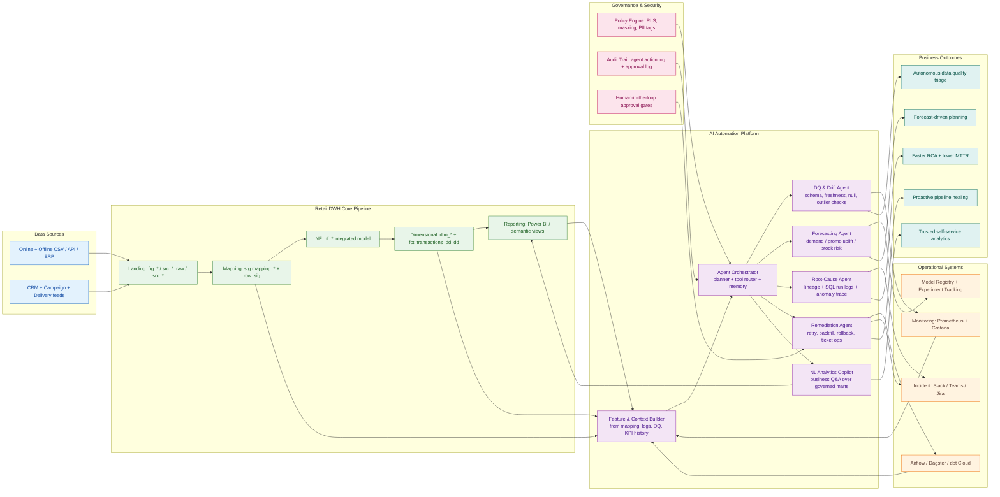

### Suggested Agentic Workflow (Execution Loop)

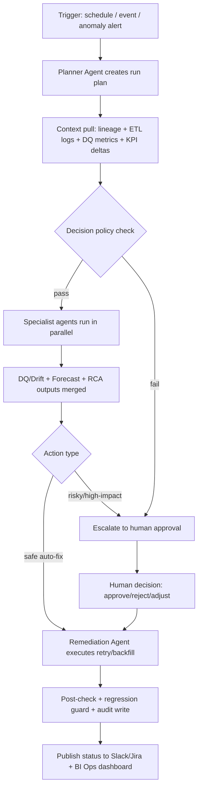

### System Blueprint (How to build around this DWH)

1. **Signals Layer:** `stg.log_etl_event`, batch/step logs, row counts, DQ scores, freshness SLA metrics.  
2. **Agent Runtime Layer:** Planner + specialist agents (DQ, Forecast, RCA, Remediation, Copilot).  
3. **Tooling Layer:** SQL runner, metadata/lineage reader, orchestration API, ticketing API, notification API.  
4. **Policy Layer:** Auto-action thresholds, PII guardrails, approval workflows, rollback criteria.  
5. **Learning Layer:** Incident outcome feedback + retraining cadence + prompt/version registry.  
6. **Business Layer:** BI semantic model + conversational analytics + proactive planning outputs.
