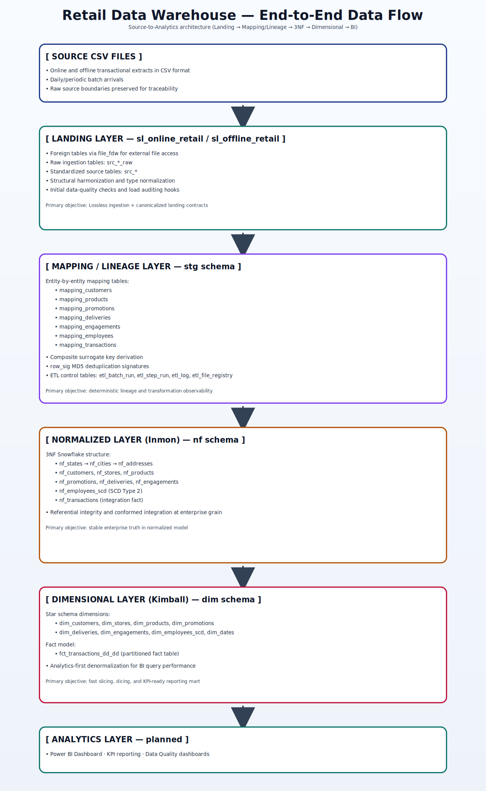

# End-to-End Data Warehouse Flow (High-Resolution Visual)

Aşağıdaki görsel, repodaki katmanlı veri ambarı akışını source seviyesinden analytics katmanına kadar tek bir dikey mimari çizim olarak sunar.

## High-Resolution Diagram

## Layer Summary

1. **Source CSV Files**
   - Online/offline CSV kaynaklarından batch veri beslemesi.

2. **Landing Layer (`sl_online_retail` / `sl_offline_retail`)**
   - `file_fdw` foreign tabloları, `src_*_raw` ham tabloları ve `src_*` standardize tabloları.

3. **Mapping / Lineage Layer (`stg`)**
   - Entity mapping tabloları, surrogate key türetimi, `row_sig` MD5 dedup ve ETL orchestration metadata tabloları.

4. **Normalized Layer (Inmon, `nf`)**
   - 3NF Snowflake yapı ve SCD Type 2 çalışan boyutu.

5. **Dimensional Layer (Kimball, `dim`)**
   - Star schema boyutları ve partitioned transaction fact tablosu.

6. **Analytics Layer (planned)**
   - Power BI, KPI raporlama ve veri kalite dashboardları.

---

> Not: SVG formatı kullanıldığı için görsel ölçeklendiğinde kalite kaybı olmadan yüksek çözünürlükte görüntülenir.
