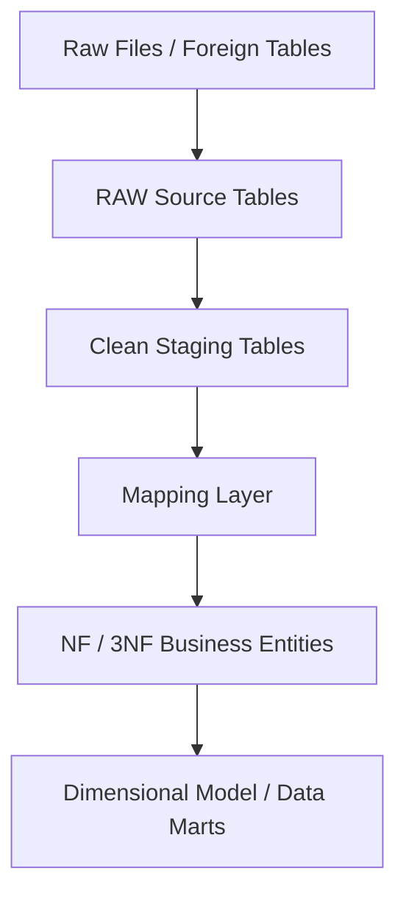
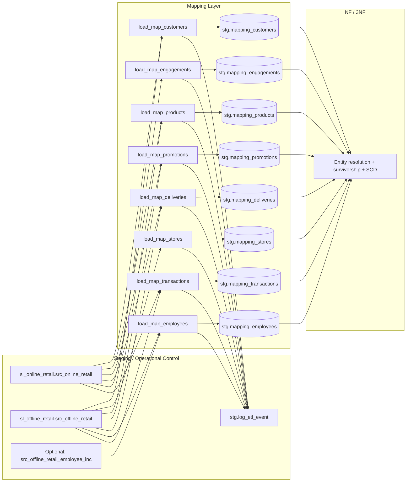

# Mapping Layer — Architectural Design

> This document is prepared based on `sql/02_mapping/01_ddls_mapping.sql` and `sql/02_mapping/02_procedures_mapping.sql`. Its purpose is to make the mapping layer easy to understand in an analytics-friendly format using visuals, flow descriptions, tables, and matrices.

## 1) Design Purpose

The mapping layer is positioned between cleaned/stabilized staging outputs and the normalized business model (NF/3NF).

- **Purpose:** Convert source-shaped data into controlled, business-meaningful structures.
- **Out of scope:** Final entity resolution, survivorship, and SCD management.
- **Critical principle:** Transform data without losing transaction-grain evidence.

In this project, the `stg` layer already handles ingestion, cleansing, orchestration, and logging responsibilities. Therefore, instead of raw file loading, the mapping layer focuses on **semantic alignment**, **lineage**, and **traceable source-to-target transformation**.

---

## 2) Architecture in Pipeline (Flow Visual)

## 3) Why the Mapping Layer Exists

Clean staging by itself is not a business model.

- `stg` makes data **clean + typed**.
- `mapping` makes data **interpretable + target-oriented**.
- `NF/3NF` makes data **entity-resolved**.
- `dimensional` optimizes data for **analytical consumption**.

This separation prevents business rules from being scattered inside NF loading SQL and keeps transformation intent visible.

---

## 4) Input Assumptions from Staging (Code-backed) - MAPPING LAYER ONLY

The following standardization patterns are already present in the `stg` layer before mapping:

| Category | Typical examples |
|---|---|
| text normalization | `LOWER`, `TRIM`, `REPLACE` |
| null handling | `COALESCE`, `NULLIF` |
| type-safe numeric conversion | `CASE WHEN ... THEN CAST(...)` |
| date parsing | `TO_DATE(...)` |
| timestamp parsing | `TO_TIMESTAMP(...)` |
| controlled value rebuilding | normalized values such as lowercase / underscore forms |
| load traceability | `insert_dt`, `batch_id`, `load_type`, `source_file_name`, `load_dts`, `source_row_num` |
| execution control | procedure orchestration + ETL logging |

### Practical implication for mapping

For this reason, instead of repeating low-level cleansing in the mapping layer, the focus should be on:

1. target column meaning
2. source-to-target traceability
3. clarity of transform rules
4. join logic
5. grain-consistent mapping decisions

---

## 5) Core Design Principles

1. **Source evidence is preserved** (no early semantic collapse).
2. **Transformation rules are kept explicit**.
3. **Technical cleansing** (`stg`) and **business interpretation** (`mapping`) are separated.
4. **Lineage** is traceable for every mapped field.
5. **Final survivorship / winner logic** is left to the NF/3NF layer.

---

## 6) Mapping Responsibility Matrix

| Design concern | Mapping owns? | Notes |
|---|---|---|
| source→target column correspondence | Yes | core responsibility |
| transformation rule declaration | Yes | clearly visible in SQL |
| lineage preservation | Yes | source_system/source_table + source keys |
| semantic normalization | Yes | meaning-level normalization |
| low-level trim/lower | Usually No | responsibility of `stg` |
| raw ingestion | No | responsibility of `stg` |
| orchestration | Upstream | `stg` / master procedures |
| batch/event logging | Upstream support | `stg` ETL logging infrastructure |
| final survivorship | No | NF/3NF |
| dim/fact presentation | No | dimensional |

---

## 7) Mapping Metadata Model (Recommended)

| Column | Purpose |
|---|---|
| `target_layer` | downstream layer identifier |
| `target_table` | target business structure |
| `target_column` | mapped attribute |
| `source_layer` | upstream context |
| `source_table` | source table |
| `source_column(s)` | source field(s) |
| `transform_rule_sql` | applied transformation |
| `join_logic` | lookup/join dependency |
| `filter_where` | row-level constraints |
| `notes` | technical/business assumptions |
| `business_definition` (opt) | semantic definition |
| `target_data_type` (opt) | implementation alignment |
| `dq_check` (opt) | expected data quality check |

---

## 8) Processing Logic (Flow Board)

### Conceptual flow

1. Clean staged source tables are taken.
2. Standardized + typed columns are read.
3. Source-to-target mapping rules are applied.
4. Grain and lineage are preserved.
5. Business-aligned mapping output is produced.
6. A controlled handoff is made to NF/3NF.

### Decision board

| Step | Question answered |
|---|---|
| Clean staging available? | Is the source ready to use? |
| Mapping rule applied? | What does this source field mean in the target? |
| Lineage captured? | Where did it come from and how was it transformed? |
| Grain preserved? | Was source evidence lost? |
| Handoff prepared? | Can NF/3NF resolve safely? |

---

## 9) Technical Dependency on `stg`

The mapping layer is technically dependent on the `stg` layer:

- raw source loading procedures
- clean staging rebuild procedures
- master orchestration procedures
- ETL log structures
- batch/file/step/event tracking objects

Result: the mapping layer remains narrower and cleaner in scope; it manages source-to-target meaning instead of raw-source mechanics.

---

## 10) Analytical Value

The mapping layer provides clear answers to these questions:

- Why does this target attribute exist?
- From which source fields was it derived?
- Were standardize/recode/join/filter rules applied?
- Which rules must stay stable across reloads?
- Which fields should not yet be treated as final business entities?

This structure significantly simplifies validation, debugging, and architectural communication.

---

## 11) Boundary with NF / 3NF

### Mapping layer
- preserves source variation
- aligns data to target meaning
- documents transform logic
- produces a controlled handoff

### NF / 3NF layer
- performs business entity resolution
- applies engineered keys
- applies survivorship
- manages SCD when required
- consolidates source variation into durable business structures

This boundary reduces the risk of early semantic collapse.

---

## 12) Real Code-Based Column-Level Mapping Matrix

The matrix below is derived directly from existing mapping SQL/procedures.

| Target table.column | Source(s) | Rule type | Transformation rule (summary) | Grain / lineage note |
|---|---|---|---|---|
| `mapping_customers.customer_id_nk` | online/offline `customer_id` | null-safe key normalization | `COALESCE(NULLIF(customer_id,''),'n.a.')` | raw NK is preserved |
| `mapping_customers.customer_src_id` | gender, marital, birth, membership, zip, city, state | composite business key derivation | fields are concatenated with `|| '-' ||` | source key for NF joins |
| `mapping_stores.store_src_id` | offline `store_location,store_city,store_state` | composite store key derivation | `location-city-state` | offline-only source |
| `mapping_products.product_src_id` | product_name/category/brand/material | composite product key derivation | `name-category-brand-material` | product meaning stabilized |
| `mapping_promotions.promotion_src_id` | promotion_type + promotion_id | semantic ID derivation | `type-id` | promotion lineage |
| `mapping_deliveries.delivery_src_id` | delivery_type + shipping_partner | composite logistics key | `type-partner` | delivery lineage |
| `mapping_employees.employee_src_id` | employee_name + hire_date | temporal/person key | `name-hire_date` | SCD2-ready evidence preserved |
| `mapping_transactions.row_sig` | many transaction fields + source ids | hash-based duplicate control | `md5(concat_ws('|', ...))` | transaction-grain dedup anchor |
| `mapping_transactions.city_src_id` | online: customer city/state; offline: store city/state fallback | fallback rule | use store city-state if available, otherwise customer city-state | lineage for city resolution |
| `mapping_transactions.employee_src_id` | offline employee fields | conditional derivation | if employee exists: `name-hire_date`, else: `n.a.` | offline variation preserved |

---

## 13) Rule Taxonomy Table (From Real Procedures)

| Rule taxonomy | Description | Where observed |
|---|---|---|
| Null normalization | pull empty/null values to sentinel values | `COALESCE/NULLIF` in all mapping procedures |
| Composite source key derivation | generation of entity-level `*_src_id` values | customer/product/promotion/delivery/store/employee |
| Source unioning | merging online + offline sources | customers/products/promotions/deliveries/transactions |
| Source-set dedup | cleaning incoming sets with `SELECT DISTINCT` | most entity load procedures |
| Target-side idempotent insert | preventing re-load duplication with `WHERE NOT EXISTS` | all mapping target inserts |
| Hash-signature dedup | dedup based on row-level signature | `mapping_transactions.row_sig` |
| Conditional fallback logic | alternative sources when fields are missing | city/employee derivation (transactions) |
| Incremental-compatible enrichment | optional check for incremental employee source | `to_regclass('...employee_inc')` |
| Operational observability | event logging + rowcount + status | `stg.log_etl_event(...)` |

---

## 14) Professional Architecture Diagram (Mapping-Focused)

---

## 15) Final Design Statement

The mapping layer should be designed as a **traceable alignment layer** between clean staging and normalized business modeling. While `stg` handles ingestion/standardization/control, the mapping layer should produce explicit source-to-target rules, preserve lineage, and create a grain-safe handoff.

In short:

- **Staging** cleans data and controls operations.
- **Mapping** explains data and aligns it to target business meaning.
- **NF / 3NF** resolves data at the business-entity level.
