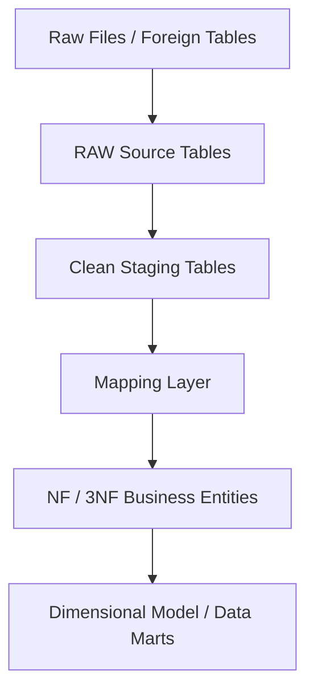
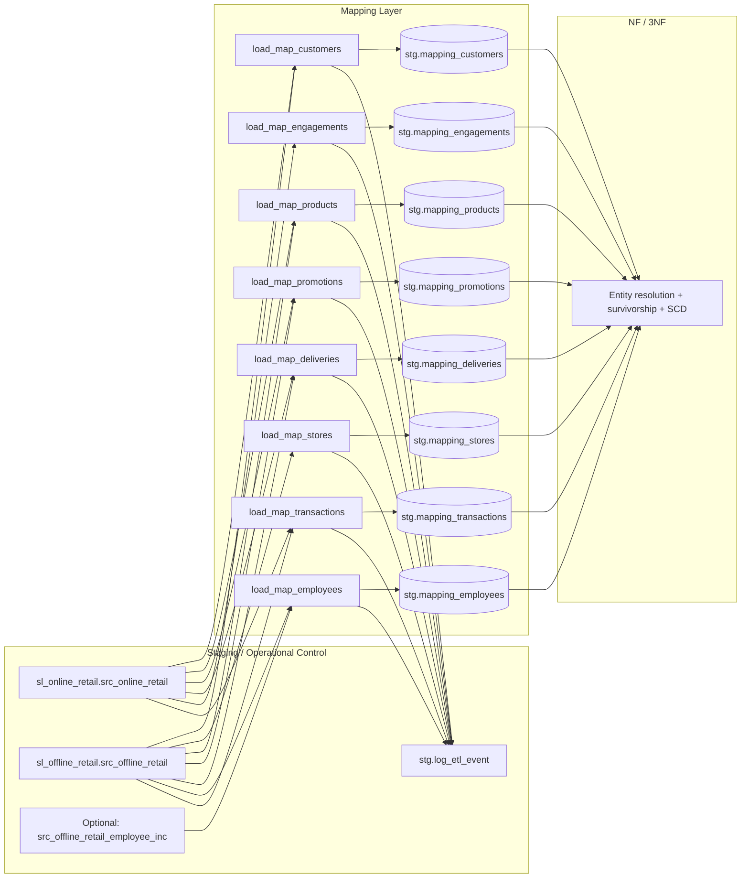

# Mapping Layer — Architectural Design

> Bu doküman, `sql/02_mapping/01_ddls_mapping.sql` ve `sql/02_mapping/02_procedures_mapping.sql` içeriği baz alınarak hazırlanmıştır. Amaç; mapping katmanını analitik okumaya uygun, görsel + akış + tablo + matris formatında anlaşılır hale getirmektir.

## 1) Design Purpose

Mapping katmanı, temizlenmiş/stabilize edilmiş staging çıktıları ile normalize iş modeli (NF/3NF) arasında konumlanır.

- **Amaç:** source-şekilli veriyi kontrollü ve iş-anlamlı yapılara çevirmek.
- **Amaç dışı:** final entity resolution, survivorship, SCD yönetimi.
- **Kritik ilke:** transaction-grain kanıtını kaybetmeden dönüşüm yapmak.

Bu projede `stg` katmanı ingestion + cleansing + orchestration + logging sorumluluklarını zaten üstlenir. Bu yüzden mapping katmanı raw dosya yükleme yerine **semantic alignment**, **lineage** ve **traceable source-to-target transformation** işine odaklanır.

---

## 2) Architecture in Pipeline (Flow Visual)

### Layer Responsibility by Stage

| Layer | Main role | What it should do | What it should not do |
|---|---|---|---|
| `stg` | ingestion + cleansing control | raw load, standardization, type-safe parse, orchestration, ETL logging | final business entity resolution |
| `mapping` | semantic alignment | source-to-target mapping, explicit rules, lineage, grain-safe handoff | premature dedup/survivorship |
| `NF / 3NF` | entity resolution | key resolution, survivorship, business constraints, SCD behavior | raw-source parsing issues |
| `dimensional` | analytics consumption | facts/dimensions, reporting models | raw-source interpretation |

---

## 3) Why Mapping Layer Exists

Temiz staging tek başına iş modeli değildir.

- `stg` veriyi **clean + typed** hale getirir.
- `mapping` veriyi **yorumlanabilir + target-oriented** hale getirir.
- `NF/3NF` veriyi **entity-resolved** hale getirir.
- `dimensional` veriyi **analitik tüketim** için optimize eder.

Bu ayrım, iş kurallarının NF yükleme SQL’lerinin içine dağılmasını önler ve dönüşüm niyetini görünür tutar.

---

## 4) Input Assumptions from Staging (Code-backed)

Aşağıdaki standardizasyon desenleri mapping öncesi `stg` katmanında zaten mevcuttur:

| Category | Typical examples |
|---|---|
| text normalization | `LOWER`, `TRIM`, `REPLACE` |
| null handling | `COALESCE`, `NULLIF` |
| type-safe numeric conversion | `CASE WHEN ... THEN CAST(...)` |
| date parsing | `TO_DATE(...)` |
| timestamp parsing | `TO_TIMESTAMP(...)` |
| controlled value rebuilding | lowercase / underscore vb. normalize değerler |
| load traceability | `insert_dt`, `batch_id`, `load_type`, `source_file_name`, `load_dts`, `source_row_num` |
| execution control | procedure orchestration + ETL logging |

### Practical implication for mapping

Bu nedenle mapping katmanında tekrar low-level cleansing yapmak yerine şu işlere odaklanılır:

1. target column meaning
2. source-to-target traceability
3. transform rule açıklığı
4. join logic
5. grain-consistent mapping decisions

---

## 5) Core Design Principles

1. **Source evidence preserve edilir** (erken semantik çöküş yok).
2. **Transformation rules explicit** tutulur.
3. **Technical cleansing** (stg) ile **business interpretation** (mapping) ayrılır.
4. **Lineage** her mapped alan için izlenebilir olur.
5. **Final survivorship / winner logic** NF/3NF katmanına bırakılır.

---

## 6) Mapping Responsibility Matrix

| Design concern | Mapping owns? | Notes |
|---|---|---|
| source→target column correspondence | Yes | core responsibility |
| transformation rule declaration | Yes | SQL içinde açıkça görülebilir |
| lineage preservation | Yes | source_system/source_table + src keys |
| semantic normalization | Yes | meaning-level normalization |
| low-level trim/lower | Usually No | stg sorumluluğu |
| raw ingestion | No | stg sorumluluğu |
| orchestration | Upstream | stg/master procedures |
| batch/event logging | Upstream support | stg ETL log altyapısı |
| final survivorship | No | NF/3NF |
| dim/fact presentation | No | dimensional |

---

## 7) Mapping Metadata Model (Recommended)

| Column | Purpose |
|---|---|
| `target_layer` | downstream katman kimliği |
| `target_table` | hedef iş yapısı |
| `target_column` | mapped attribute |
| `source_layer` | upstream context |
| `source_table` | kaynak tablo |
| `source_column(s)` | kaynak alan(lar) |
| `transform_rule_sql` | uygulanan dönüşüm |
| `join_logic` | lookup/join bağımlılığı |
| `filter_where` | satır kısıtları |
| `notes` | teknik/iş varsayımı |
| `business_definition` (opt) | semantik tanım |
| `target_data_type` (opt) | implementation alignment |
| `dq_check` (opt) | beklenen kalite kontrolü |

---

## 8) Processing Logic (Flow Board)

### Conceptual flow

1. Clean staged source tabloları alınır.
2. Standardize + typed kolonlar okunur.
3. Source-to-target mapping kuralları uygulanır.
4. Grain ve lineage korunur.
5. Business-aligned mapping çıktısı üretilir.
6. NF/3NF’ye kontrollü handoff yapılır.

### Decision board

| Step | Question answered |
|---|---|
| Clean staging available? | Source kullanılabilir mi? |
| Mapping rule applied? | Bu kaynak alan hedefte ne anlama geliyor? |
| Lineage captured? | Nereden geldi, nasıl dönüştü? |
| Grain preserved? | Kaynak kanıtı kaybedildi mi? |
| Handoff prepared? | NF/3NF güvenli resolve yapabilir mi? |

---

## 9) Technical Dependency on `stg`

Mapping katmanı teknik temel olarak `stg` katmanına bağımlıdır:

- raw source loading procedures
- clean staging rebuild procedures
- master orchestration procedures
- ETL log structures
- batch/file/step/event tracking objeleri

Sonuç: mapping katmanı daha dar ve temiz kapsamda kalır; raw-source mechanics yerine source-to-target anlamı yönetir.

---

## 10) Analytical Value

Mapping katmanı şu sorulara net cevap verir:

- Bu target attribute neden var?
- Hangi source alanlardan üretildi?
- Standardize/recode/join/filter uygulandı mı?
- Hangi kurallar reload’larda stabil kalmalı?
- Hangi alanlar henüz final business entity gibi ele alınmamalı?

Bu yapı validasyon, debug ve mimari anlatımı ciddi ölçüde kolaylaştırır.

---

## 11) Boundary with NF / 3NF

### Mapping layer
- source variation’ı korur
- target anlamına hizalar
- transform logic’i dokümante eder
- kontrollü handoff üretir

### NF / 3NF layer
- business entity çözümü yapar
- engineered keys uygular
- survivorship uygular
- gerekiyorsa SCD yönetir
- source variation’ı durable business yapılara konsolide eder

Bu sınır, erken semantic collapse riskini azaltır.

---

## 12) Real Code-Based Column-Level Mapping Matrix

Aşağıdaki matris doğrudan mevcut mapping SQL/procedure’lardan türetilmiştir.

| Target table.column | Source(s) | Rule type | Transformation rule (özet) | Grain / lineage note |
|---|---|---|---|---|
| `mapping_customers.customer_id_nk` | online/offline `customer_id` | null-safe key normalization | `COALESCE(NULLIF(customer_id,''),'n.a.')` | raw NK korunur |
| `mapping_customers.customer_src_id` | gender, marital, birth, membership, zip, city, state | composite business key derivation | alanlar `|| '-' ||` ile birleştirilir | NF join için source key |
| `mapping_stores.store_src_id` | offline `store_location,store_city,store_state` | composite store key derivation | `location-city-state` | offline-only source |
| `mapping_products.product_src_id` | product_name/category/brand/material | composite product key derivation | `name-category-brand-material` | product meaning stabilized |
| `mapping_promotions.promotion_src_id` | promotion_type + promotion_id | semantic ID derivation | `type-id` | promotion lineage |
| `mapping_deliveries.delivery_src_id` | delivery_type + shipping_partner | composite logistics key | `type-partner` | delivery lineage |
| `mapping_employees.employee_src_id` | employee_name + hire_date | temporal/person key | `name-hire_date` | SCD2-ready evidence preserved |
| `mapping_transactions.row_sig` | many txn fields + source ids | hash-based duplicate control | `md5(concat_ws('|', ...))` | transaction-grain dedup anchor |
| `mapping_transactions.city_src_id` | online: customer city/state; offline: store city/state fallback | fallback rule | store city-state varsa onu, yoksa customer city-state | şehir çözümü için lineage |
| `mapping_transactions.employee_src_id` | offline employee fields | conditional derivation | employee varsa `name-hire_date`, yoksa `n.a.` | offline variation preserved |

---

## 13) Rule Taxonomy Table (From Real Procedures)

| Rule taxonomy | Description | Where observed |
|---|---|---|
| Null normalization | boş/null değerleri sentinel değere çekme | tüm mapping proc’larda `COALESCE/NULLIF` |
| Composite source key derivation | entity-level `*_src_id` üretimi | customer/product/promotion/delivery/store/employee |
| Source unioning | online + offline birleşimi | customers/products/promotions/deliveries/transactions |
| Source-set dedup | `SELECT DISTINCT` ile incoming set temizliği | çoğu entity load proc |
| Target-side idempotent insert | `WHERE NOT EXISTS` ile tekrar yükleme engeli | tüm mapping target insert’leri |
| Hash-signature dedup | row-level signature üzerinden dedup | `mapping_transactions.row_sig` |
| Conditional fallback logic | source alan yoksa alternatif kaynak | city/employee derivation (transactions) |
| Incremental-compatible enrichment | opsiyonel incremental employee source kontrolü | `to_regclass('...employee_inc')` |
| Operational observability | event logging + rowcount + status | `stg.log_etl_event(...)` |

---

## 14) Professional Architecture Diagram (Mapping-Focused)

---

## 15) Final Design Statement

Mapping layer; clean staging ile normalized business modeling arasında **traceable alignment katmanı** olarak tasarlanmalıdır. `stg` ingestion/standardization/control işini üstlenirken mapping katmanı explicit source-to-target kuralları, lineage koruması ve grain-safe handoff üretmelidir.

Kısaca:

- **Staging** veriyi temizler ve operasyonel olarak kontrol eder.
- **Mapping** veriyi açıklar ve hedef iş anlamına hizalar.
- **NF / 3NF** veriyi business entity seviyesinde çözer.

